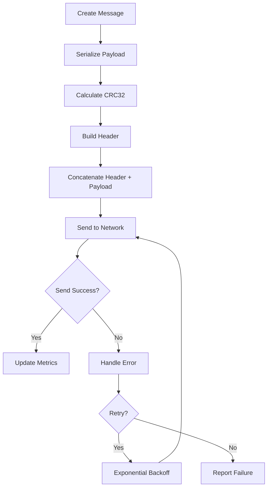
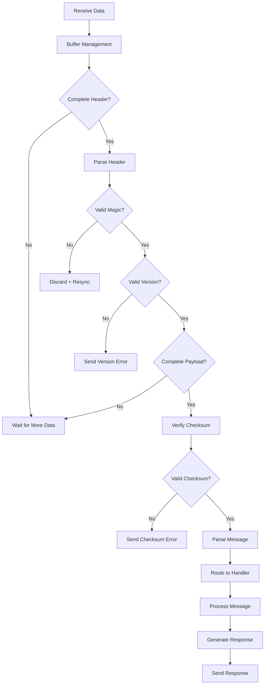

================================================================================
HYPERCACHE CUSTOM BINARY PROTOCOL SPECIFICATION
================================================================================
Project: HyperCache Distributed Cache System
Topic: Internal Cluster Communication Protocol Design
Date: August 20, 2025

================================================================================
PROTOCOL OVERVIEW AND RATIONALE
================================================================================

## Why a Custom Binary Protocol?

While we use **RESP for client-facing operations**, internal cluster communication needs different optimizations:

### Client-Facing (RESP):
- ✅ **Human readable** for debugging
- ✅ **Ecosystem compatibility** with Redis clients
- ✅ **Extensible** with custom commands
- ❌ **Higher overhead** for high-frequency internal operations

### Internal Cluster (Custom Binary):
- ✅ **Minimal overhead** for consensus and replication
- ✅ **Type safety** with structured messages  
- ✅ **Optimized serialization** for our data structures
- ✅ **Built-in versioning** for protocol evolution
- ❌ **Not human readable** (debugging requires tools)

## Design Goals

### Performance:
- **Low Latency**: < 1ms serialization/deserialization overhead
- **High Throughput**: Support for 100K+ internal messages/sec per node
- **Memory Efficient**: Zero-copy operations where possible

### Reliability:
- **Message Integrity**: Built-in checksums for corruption detection
- **Version Compatibility**: Forward/backward compatibility for upgrades
- **Error Recovery**: Explicit error codes and retry semantics

### Maintainability:
- **Self-Describing**: Message types and schemas embedded
- **Evolvable**: Easy to add new message types and fields
- **Debuggable**: Binary-to-text conversion tools

================================================================================
MESSAGE FORMAT SPECIFICATION
================================================================================

## Wire Format Layout

```
┌─────────────┬──────────────┬──────────────┬──────────────┬────────────┬──────────────┐
│   Magic     │   Version    │   Message    │   Length     │  Checksum  │   Payload    │
│  (4 bytes)  │  (1 byte)    │   Type       │  (4 bytes)   │ (4 bytes)  │  (Variable)  │
│             │              │  (1 byte)    │              │            │              │
└─────────────┴──────────────┴──────────────┴──────────────┴────────────┴──────────────┘
```

### Header Fields (14 bytes total):

#### Magic Number (4 bytes): `0x48435241` ('HCAR' in ASCII)
- **Purpose**: Protocol identification and frame synchronization
- **Value**: Always `0x48435241` (HyperCache Raft)
- **Usage**: Receivers discard data until magic number found

#### Version (1 byte): Current = `0x01`
- **Purpose**: Protocol version for compatibility checking
- **Values**: 
  - `0x01`: Initial protocol version
  - `0x02-0xFF`: Future versions
- **Compatibility**: Major version changes break compatibility

#### Message Type (1 byte): See message types below
- **Purpose**: Determines payload structure and handling
- **Range**: `0x01-0xFF` (0x00 reserved for heartbeat)

#### Length (4 bytes, Big Endian): Payload length
- **Purpose**: Payload size in bytes (excludes header)
- **Range**: 0 to 4,294,967,295 bytes
- **Usage**: Enables streaming parsing and memory allocation

#### Checksum (4 bytes, Big Endian): CRC32 of payload
- **Purpose**: Detect message corruption during transmission
- **Algorithm**: CRC32 IEEE 802.3 polynomial
- **Scope**: Checksum covers payload only (not header)

## Message Types

### Raft Consensus Messages (0x10-0x1F)

#### `0x10` - Vote Request
Used during leader election
```
Payload Structure:
┌─────────────┬─────────────┬─────────────┬─────────────┐
│    Term     │ Candidate   │ Last Log    │ Last Log    │
│  (8 bytes)  │    ID       │   Index     │    Term     │
│             │  (8 bytes)  │  (8 bytes)  │  (8 bytes)  │
└─────────────┴─────────────┴─────────────┴─────────────┘
```

#### `0x11` - Vote Response  
Response to vote request
```
Payload Structure:
┌─────────────┬─────────────┬─────────────┐
│    Term     │ Vote        │  Reserved   │
│  (8 bytes)  │ Granted     │  (7 bytes)  │
│             │  (1 byte)   │             │
└─────────────┴─────────────┴─────────────┘
```

#### `0x12` - Append Entries
Log replication and heartbeat
```
Payload Structure:
┌─────────────┬─────────────┬─────────────┬─────────────┬─────────────┬─────────────┐
│    Term     │  Leader ID  │  Prev Log   │  Prev Log   │   Leader    │   Entry     │
│  (8 bytes)  │  (8 bytes)  │   Index     │    Term     │   Commit    │   Count     │
│             │             │  (8 bytes)  │  (8 bytes)  │  (8 bytes)  │  (4 bytes)  │
└─────────────┴─────────────┴─────────────┴─────────────┴─────────────┴─────────────┘
│                                  Log Entries (Variable Length)                   │
└───────────────────────────────────────────────────────────────────────────────────┘

Each Log Entry:
┌─────────────┬─────────────┬─────────────┬─────────────┐
│    Term     │    Type     │   Data      │    Data     │
│  (8 bytes)  │  (1 byte)   │   Length    │             │
│             │             │  (4 bytes)  │ (Variable)  │
└─────────────┴─────────────┴─────────────┴─────────────┘
```

#### `0x13` - Append Response
Response to append entries
```
Payload Structure:
┌─────────────┬─────────────┬─────────────┬─────────────┐
│    Term     │   Success   │ Conflict    │ Conflict    │
│  (8 bytes)  │  (1 byte)   │   Index     │    Term     │
│             │             │  (8 bytes)  │  (8 bytes)  │
└─────────────┴─────────────┴─────────────┴─────────────┘
```

### Data Replication Messages (0x20-0x2F)

#### `0x20` - Replicate Data
Async data replication between nodes
```
Payload Structure:
┌─────────────┬─────────────┬─────────────┬─────────────┬─────────────┐
│  Operation  │    Store    │    Key      │    Value    │     TTL     │
│    Type     │    Name     │   Length    │   Length    │  (8 bytes)  │
│  (1 byte)   │   Length    │  (4 bytes)  │  (4 bytes)  │             │
│             │  (1 byte)   │             │             │             │
└─────────────┴─────────────┴─────────────┴─────────────┴─────────────┘
│     Store Name        │       Key Data        │      Value Data      │
│     (Variable)        │      (Variable)       │      (Variable)      │
└───────────────────────┴───────────────────────┴──────────────────────┘

Operation Types:
- 0x01: SET
- 0x02: DELETE  
- 0x03: EXPIRE
```

#### `0x21` - Replicate Response
Response to data replication
```
Payload Structure:
┌─────────────┬─────────────┬─────────────┐
│   Status    │ Error Code  │  Reserved   │
│  (1 byte)   │  (1 byte)   │  (6 bytes)  │
└─────────────┴─────────────┴─────────────┘

Status Values:
- 0x00: Success
- 0x01: Error (see error code)
- 0x02: Retry Later
```

### Cluster Management Messages (0x30-0x3F)

#### `0x30` - Node Join Request
New node requesting to join cluster
```
Payload Structure:
┌─────────────┬─────────────┬─────────────┬─────────────┬─────────────┐
│   Node ID   │    Host     │    Port     │  Node Type  │ Capabilities│
│  (8 bytes)  │   Length    │  (2 bytes)  │  (1 byte)   │  (4 bytes)  │
│             │  (1 byte)   │             │             │             │
└─────────────┴─────────────┴─────────────┴─────────────┴─────────────┘
│       Host String         │
│       (Variable)          │
└───────────────────────────┘

Node Types:
- 0x01: Cache Node
- 0x02: Proxy Node
- 0x03: Storage Node

Capabilities (Bitfield):
- Bit 0: Supports Cuckoo Filters  
- Bit 1: Supports Compression
- Bit 2: Supports TLS
- Bits 3-31: Reserved
```

#### `0x31` - Node Join Response
Response to join request
```
Payload Structure:
┌─────────────┬─────────────┬─────────────┬─────────────┐
│   Status    │ Error Code  │ Cluster ID  │  Reserved   │
│  (1 byte)   │  (1 byte)   │  (8 bytes)  │  (6 bytes)  │
└─────────────┴─────────────┴─────────────┴─────────────┘
```

#### `0x32` - Heartbeat
Node health check
```
Payload Structure:
┌─────────────┬─────────────┬─────────────┬─────────────┐
│  Node ID    │  Timestamp  │    Load     │  Reserved   │
│  (8 bytes)  │  (8 bytes)  │  (4 bytes)  │  (4 bytes)  │
└─────────────┴─────────────┴─────────────┴─────────────┘

Load: CPU usage percentage (0-10000, representing 0.00% to 100.00%)
```

#### `0x33` - Heartbeat Response  
Response to heartbeat
```
Payload Structure:
┌─────────────┬─────────────┬─────────────┐
│  Timestamp  │   Status    │  Reserved   │
│  (8 bytes)  │  (1 byte)   │  (7 bytes)  │
└─────────────┴─────────────┴─────────────┘
```

### Hash Ring Messages (0x40-0x4F)

#### `0x40` - Hash Ring Update
Notify nodes of hash ring changes
```
Payload Structure:
┌─────────────┬─────────────┬─────────────┐
│   Version   │    Node     │  Reserved   │
│  (8 bytes)  │   Count     │  (3 bytes)  │
│             │  (4 bytes)  │             │
└─────────────┴─────────────┴─────────────┘

For each node:
┌─────────────┬─────────────┬─────────────┬─────────────┐
│   Node ID   │    Hash     │  V-Nodes    │    Host     │
│  (8 bytes)  │  (8 bytes)  │   Count     │    Info     │
│             │             │  (4 bytes)  │ (Variable)  │
└─────────────┴─────────────┴─────────────┴─────────────┘
```

#### `0x41` - Hash Ring Query
Request current hash ring state
```
Payload Structure:
┌─────────────┬─────────────┐
│  Node ID    │  Reserved   │
│  (8 bytes)  │  (8 bytes)  │
└─────────────┴─────────────┘
```

### Error Messages (0xF0-0xFF)

#### `0xFF` - Generic Error
General error response
```
Payload Structure:
┌─────────────┬─────────────┬─────────────┬─────────────┐
│ Error Code  │ Error Msg   │    Extra    │ Error Msg   │
│  (2 bytes)  │  Length     │    Data     │    Data     │
│             │  (2 bytes)  │  (4 bytes)  │ (Variable)  │
└─────────────┴─────────────┴─────────────┴─────────────┘

Error Codes:
- 0x0001: Unknown Message Type
- 0x0002: Invalid Protocol Version  
- 0x0003: Checksum Mismatch
- 0x0004: Message Too Large
- 0x0005: Node Not Authorized
- 0x0006: Cluster Full
- 0x0007: Internal Server Error
```

================================================================================
SERIALIZATION AND ENCODING DETAILS
================================================================================

## Byte Order (Endianness)

**All multi-byte integers use Big Endian (Network Byte Order)**
```
Example: 32-bit integer 0x12345678 → Wire: [0x12, 0x34, 0x56, 0x78]

Rationale: 
- Standard for network protocols
- Consistent across different architectures  
- Easy debugging with hexdump tools
```

## String Encoding

**All strings use UTF-8 encoding**
```
Length Prefix: Variable-length strings prefixed with length
Example: "hello" → [0x05, 'h', 'e', 'l', 'l', 'o']

Fixed Length: Some fields have fixed maximum lengths
Example: Node ID as string, max 64 bytes
```

## Timestamp Format

**64-bit Unix nanoseconds (Big Endian)**
```
Range: 0 to ~584 years from Unix epoch
Resolution: Nanosecond precision
Example: 2025-08-20T10:30:45.123456789Z → 1724148645123456789 → 0x17E8F5F5F5F5F5F5
```

## Boolean Values

**1-byte boolean representation**
```
0x00: False
0x01: True
0x02-0xFF: Reserved (treat as true for forward compatibility)
```

## Variable-Length Encoding

For efficiently encoding small integers:
```
VarInt Encoding (LEB128):
- Values 0-127: 1 byte
- Values 128-16383: 2 bytes  
- Values 16384-2097151: 3 bytes
- And so on...

Usage: Message lengths, array counts, optional optimizations
```

================================================================================
MESSAGE PROCESSING PIPELINE
================================================================================

## Sender Side Processing



## Receiver Side Processing



## Connection State Machine

```go
type ConnectionState int

const (
    Disconnected ConnectionState = iota
    Connecting
    Handshaking      // Protocol version negotiation
    Authenticating   // Node authentication if required
    Connected        // Ready for normal operation
    Closing          // Graceful shutdown in progress
    Error            // Unrecoverable error state
)
```

## Message Routing

```go
type MessageRouter struct {
    handlers map[MessageType]MessageHandler
    metrics  *MessageMetrics
    logger   Logger
}

type MessageHandler interface {
    Handle(ctx context.Context, msg *Message) (*Message, error)
    MessageType() MessageType
    RequiresAuth() bool
}

// Example routing
func (r *MessageRouter) Route(ctx context.Context, msg *Message) error {
    handler, exists := r.handlers[msg.Type]
    if !exists {
        return r.sendError(msg, ErrorUnknownMessageType)
    }
    
    if handler.RequiresAuth() && !msg.Connection.IsAuthenticated() {
        return r.sendError(msg, ErrorNotAuthorized)
    }
    
    response, err := handler.Handle(ctx, msg)
    if err != nil {
        return r.sendError(msg, ErrorInternalServerError)
    }
    
    if response != nil {
        return msg.Connection.SendMessage(response)
    }
    
    return nil
}
```

================================================================================
PERFORMANCE OPTIMIZATIONS
================================================================================

## Zero-Copy Operations

### Buffer Pooling:
```go
var messageBufferPool = sync.Pool{
    New: func() interface{} {
        return make([]byte, 0, 64*1024) // 64KB initial capacity
    },
}

func getMessage() []byte {
    buf := messageBufferPool.Get().([]byte)
    return buf[:0] // Reset length but keep capacity
}

func putMessage(buf []byte) {
    if cap(buf) <= 1024*1024 { // Don't pool buffers > 1MB
        messageBufferPool.Put(buf)
    }
}
```

### Slice Operations:
```go
// Avoid copying when parsing fixed-size fields
func parseNodeID(data []byte, offset int) uint64 {
    // Direct conversion instead of copying 8 bytes
    return binary.BigEndian.Uint64(data[offset:offset+8])
}

// Use unsafe for string conversion when safe
func bytesToString(b []byte) string {
    return *(*string)(unsafe.Pointer(&b))
}
```

## Batch Processing

### Message Batching:
```go
type MessageBatch struct {
    messages []Message
    maxSize  int
    maxDelay time.Duration
    timer    *time.Timer
}

func (b *MessageBatch) Add(msg Message) {
    b.messages = append(b.messages, msg)
    
    if len(b.messages) == 1 {
        // Start timer for first message
        b.timer = time.AfterFunc(b.maxDelay, b.flush)
    }
    
    if len(b.messages) >= b.maxSize {
        b.flush()
    }
}

func (b *MessageBatch) flush() {
    if len(b.messages) == 0 {
        return
    }
    
    // Send all messages as a single network operation
    combinedPayload := b.combineMessages()
    sendToNetwork(combinedPayload)
    
    b.messages = b.messages[:0]
    if b.timer != nil {
        b.timer.Stop()
        b.timer = nil
    }
}
```

## Connection Multiplexing

### Stream Multiplexing:
```go
type MultiplexedConnection struct {
    conn    net.Conn
    streams map[uint16]*Stream
    mutex   sync.RWMutex
    nextID  uint16
}

type Stream struct {
    id       uint16
    inbound  chan Message
    outbound chan Message
    closed   chan struct{}
}

func (mc *MultiplexedConnection) CreateStream() *Stream {
    mc.mutex.Lock()
    defer mc.mutex.Unlock()
    
    id := mc.nextID
    mc.nextID++
    
    stream := &Stream{
        id:       id,
        inbound:  make(chan Message, 100),
        outbound: make(chan Message, 100),
        closed:   make(chan struct{}),
    }
    
    mc.streams[id] = stream
    return stream
}
```

## Compression

### Optional Payload Compression:
```go
const CompressionThreshold = 1024 // Compress if payload > 1KB

func (msg *Message) Serialize() []byte {
    payload := msg.marshalPayload()
    
    if len(payload) > CompressionThreshold {
        compressed, err := compress(payload)
        if err == nil && len(compressed) < len(payload) {
            msg.Header.Flags |= FlagCompressed
            payload = compressed
        }
    }
    
    header := msg.marshalHeader(len(payload))
    return append(header, payload...)
}
```

================================================================================
SECURITY CONSIDERATIONS
================================================================================

## Authentication

### Node Authentication:
```go
type NodeCredential struct {
    NodeID    uint64
    SharedKey []byte // 32-byte key for HMAC
    ValidFrom time.Time
    ValidTo   time.Time
}

func (cred *NodeCredential) SignMessage(msg *Message) {
    // HMAC-SHA256 signature
    h := hmac.New(sha256.New, cred.SharedKey)
    h.Write(msg.Header.Marshal())
    h.Write(msg.Payload)
    
    msg.Header.Signature = h.Sum(nil)[:16] // Truncate to 16 bytes
    msg.Header.Flags |= FlagSigned
}

func (cred *NodeCredential) VerifyMessage(msg *Message) bool {
    if msg.Header.Flags&FlagSigned == 0 {
        return false
    }
    
    h := hmac.New(sha256.New, cred.SharedKey)
    h.Write(msg.Header.MarshalWithoutSignature())
    h.Write(msg.Payload)
    
    expected := h.Sum(nil)[:16]
    return hmac.Equal(expected, msg.Header.Signature)
}
```

## Message Integrity

### Enhanced Checksum:
```go
// Instead of simple CRC32, use cryptographic hash for sensitive messages
func calculateSecureChecksum(payload []byte, key []byte) []byte {
    h := hmac.New(sha256.New, key)
    h.Write(payload)
    return h.Sum(nil)[:8] // Use first 8 bytes as checksum
}
```

## Rate Limiting

### Per-Connection Rate Limiting:
```go
type RateLimiter struct {
    tokens   int
    maxTokens int
    refillRate time.Duration
    lastRefill time.Time
    mutex    sync.Mutex
}

func (rl *RateLimiter) AllowMessage(msgType MessageType) bool {
    rl.mutex.Lock()
    defer rl.mutex.Unlock()
    
    // Refill tokens based on time elapsed
    now := time.Now()
    elapsed := now.Sub(rl.lastRefill)
    tokensToAdd := int(elapsed / rl.refillRate)
    
    rl.tokens = min(rl.maxTokens, rl.tokens + tokensToAdd)
    rl.lastRefill = now
    
    // Check if message is allowed
    cost := getMessageCost(msgType)
    if rl.tokens >= cost {
        rl.tokens -= cost
        return true
    }
    
    return false
}

func getMessageCost(msgType MessageType) int {
    switch msgType {
    case MessageHeartbeat:
        return 1
    case MessageVoteRequest, MessageVoteResponse:
        return 5
    case MessageAppendEntries:
        return 10
    default:
        return 3
    }
}
```

================================================================================
DEBUGGING AND OBSERVABILITY
================================================================================

## Message Tracing

### Request ID Tracking:
```go
type MessageContext struct {
    RequestID   [16]byte // UUID for tracing
    ParentID    [16]byte // For nested requests
    Timestamp   int64    // Creation time
    NodePath    []uint64 // Path through cluster nodes
}

func (ctx *MessageContext) AddToPath(nodeID uint64) {
    ctx.NodePath = append(ctx.NodePath, nodeID)
}

func (ctx *MessageContext) GenerateChildContext() MessageContext {
    child := MessageContext{
        RequestID:   generateUUID(),
        ParentID:    ctx.RequestID,
        Timestamp:   time.Now().UnixNano(),
        NodePath:    make([]uint64, 0, len(ctx.NodePath)),
    }
    copy(child.NodePath, ctx.NodePath)
    return child
}
```

## Binary Message Inspector

### Debug Tool:
```go
func DumpMessage(msg []byte) string {
    if len(msg) < 14 {
        return "Invalid message: too short"
    }
    
    var b strings.Builder
    
    // Parse header
    magic := binary.BigEndian.Uint32(msg[0:4])
    version := msg[4]
    msgType := msg[5]
    length := binary.BigEndian.Uint32(msg[6:10])
    checksum := binary.BigEndian.Uint32(msg[10:14])
    
    b.WriteString(fmt.Sprintf("Magic: 0x%08X (%c%c%c%c)\n", 
        magic, msg[0], msg[1], msg[2], msg[3]))
    b.WriteString(fmt.Sprintf("Version: %d\n", version))
    b.WriteString(fmt.Sprintf("Type: 0x%02X (%s)\n", msgType, messageTypeName(msgType)))
    b.WriteString(fmt.Sprintf("Length: %d bytes\n", length))
    b.WriteString(fmt.Sprintf("Checksum: 0x%08X\n", checksum))
    
    if len(msg) >= 14+int(length) {
        payload := msg[14:14+length]
        calculatedChecksum := crc32.ChecksumIEEE(payload)
        
        if calculatedChecksum == checksum {
            b.WriteString("Checksum: ✅ Valid\n")
        } else {
            b.WriteString(fmt.Sprintf("Checksum: ❌ Invalid (expected 0x%08X)\n", calculatedChecksum))
        }
        
        b.WriteString("\nPayload (hex):\n")
        b.WriteString(hex.Dump(payload))
        
        // Try to parse message-specific fields
        b.WriteString("\nParsed Fields:\n")
        b.WriteString(parseMessageFields(MessageType(msgType), payload))
    }
    
    return b.String()
}
```

## Performance Monitoring

### Message Metrics:
```go
type MessageMetrics struct {
    sentCount     map[MessageType]int64
    receivedCount map[MessageType]int64
    errorCount    map[MessageType]int64
    latency       map[MessageType]time.Duration
    mutex         sync.RWMutex
}

func (m *MessageMetrics) RecordSent(msgType MessageType, latency time.Duration) {
    m.mutex.Lock()
    defer m.mutex.Unlock()
    
    m.sentCount[msgType]++
    m.latency[msgType] = (m.latency[msgType] + latency) / 2 // Running average
}

func (m *MessageMetrics) GetStats() map[string]interface{} {
    m.mutex.RLock()
    defer m.mutex.RUnlock()
    
    stats := make(map[string]interface{})
    
    for msgType, count := range m.sentCount {
        typeName := messageTypeName(msgType)
        stats[fmt.Sprintf("%s_sent", typeName)] = count
        stats[fmt.Sprintf("%s_received", typeName)] = m.receivedCount[msgType]
        stats[fmt.Sprintf("%s_errors", typeName)] = m.errorCount[msgType]
        stats[fmt.Sprintf("%s_latency_ms", typeName)] = m.latency[msgType].Milliseconds()
    }
    
    return stats
}
```

================================================================================
IMPLEMENTATION ROADMAP
================================================================================

## Phase 1: Core Protocol Infrastructure (Week 1)
- ✅ **Message Serialization**: Header format, basic encoding/decoding
- ✅ **Transport Layer**: TCP connections, framing, error recovery  
- ✅ **Message Routing**: Type-based handler dispatch
- ✅ **Basic Security**: CRC32 checksums, connection validation

## Phase 2: Raft Messages (Week 2)
- ✅ **Vote Messages**: RequestVote, VoteResponse serialization
- ✅ **Append Messages**: AppendEntries with log entry batching
- ✅ **State Transfer**: Snapshot installation messages
- ✅ **Optimization**: Message compression, batching

## Phase 3: Data Replication (Week 2-3)
- ✅ **Replication Messages**: Async data transfer between nodes
- ✅ **Conflict Resolution**: Version vectors, timestamp ordering
- ✅ **Flow Control**: Backpressure, buffering strategies
- ✅ **Monitoring**: Message metrics, latency tracking

## Phase 4: Advanced Features (Week 3-4)
- ✅ **Connection Multiplexing**: Multiple streams per connection
- ✅ **Authentication**: Node identity verification, HMAC signatures
- ✅ **Rate Limiting**: Per-connection message rate controls
- ✅ **Debugging Tools**: Binary message inspector, trace logging

**Ready to implement!** This binary protocol will provide high-performance, reliable communication between HyperCache cluster nodes while maintaining the simplicity needed for correct implementation.
