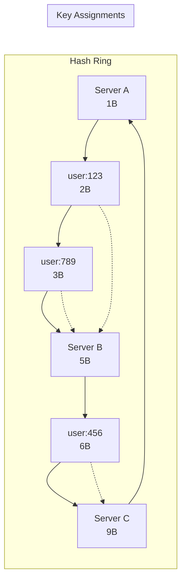
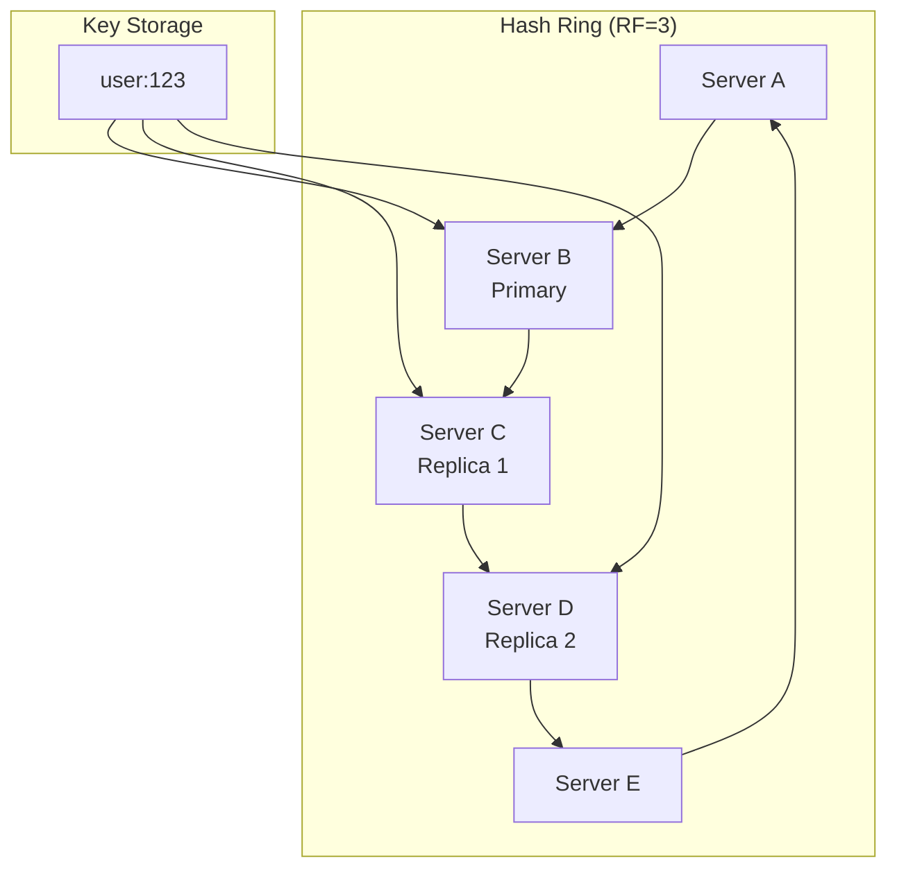

================================================================================
CONSISTENT HASHING FOR DISTRIBUTED CACHING
================================================================================
Project: HyperCache Distributed Cache System
Topic: Consistent Hashing Algorithm and Implementation Deep Dive
Date: August 20, 2025

================================================================================
WHAT IS CONSISTENT HASHING AND WHY DO WE NEED IT?
================================================================================

## The Distributed Data Placement Problem

Imagine you have a cache with 1 million keys distributed across 3 servers:

### **Traditional Hash-Based Distribution:**
```
hash(key) % num_servers = server_index

Examples:
hash("user:123") % 3 = 1 → Server 1
hash("user:456") % 3 = 2 → Server 2  
hash("user:789") % 3 = 0 → Server 0
```

**This works fine until...**

### **The Problem: Server Addition/Removal**
```
Original: 3 servers → hash(key) % 3
Add 1 server: 4 servers → hash(key) % 4

Result: ~75% of keys move to different servers!

Example:
hash("user:123") % 3 = 1 → Server 1
hash("user:123") % 4 = 2 → Server 2 ← MOVED!

Impact: 750,000 out of 1M keys need to be rehashed and moved
```

## Why This is Catastrophic for Caches

### **Cache Miss Avalanche:**
- 🔥 **75% cache miss rate** immediately after rebalancing
- 🔥 **Database overwhelmed** by sudden load increase
- 🔥 **Cascade failures** as systems can't handle the load
- 🔥 **Poor user experience** with slow response times

### **Operational Nightmares:**
- 🚨 **Expensive data movement**: 750k keys need network transfer
- 🚨 **Service downtime**: Systems may be unusable during rebalancing
- 🚨 **Manual intervention**: Complex operational procedures
- 🚨 **Risk of data loss**: Failures during data movement

## Consistent Hashing: The Solution

**Goal**: Minimize key redistribution when cluster membership changes

**Key Insight**: Instead of hashing keys to servers directly, hash both keys and servers to points on a circle (hash ring).

### **Benefits:**
- ✅ **Minimal Disruption**: Only ~N/M keys move (N=keys, M=servers)
- ✅ **Gradual Rebalancing**: Keys can be moved incrementally  
- ✅ **High Availability**: No service interruption during changes
- ✅ **Automatic Load Balancing**: Even distribution across servers

================================================================================
CONSISTENT HASHING ALGORITHM
================================================================================

## Core Concept: The Hash Ring

Imagine a circular hash space from 0 to 2^64-1:

```
                    0 / 2^64
                        |
              2^62      |      2^62
                    \   |   /
                     \  |  /
            2^63  ---- Ring ----  2^61
                     /  |  \
                    /   |   \
              2^62      |      2^60
                        |
                     2^63
```

### **Step 1: Place Servers on the Ring**
Hash each server's identifier to get its position:

```
Server A: hash("server-a") = 1,000,000,000 → Position on ring
Server B: hash("server-b") = 5,000,000,000 → Position on ring  
Server C: hash("server-c") = 9,000,000,000 → Position on ring
```

### **Step 2: Place Keys on the Ring**
Hash each key to get its position:

```
Key "user:123": hash("user:123") = 2,000,000,000
Key "user:456": hash("user:456") = 6,000,000,000
Key "user:789": hash("user:789") = 3,000,000,000
```

### **Step 3: Assign Keys to Servers**
Each key belongs to the first server clockwise from its position:

```
Ring positions (clockwise):
1B (Server A) → 2B (user:123) → 3B (user:789) → 5B (Server B) → 6B (user:456) → 9B (Server C)

Assignments:
- user:123 → Server B (next clockwise from position 2B)
- user:789 → Server B (next clockwise from position 3B)  
- user:456 → Server C (next clockwise from position 6B)
```

## Visual Representation



## What Happens When We Add a Server?

### **Adding Server D at position 4B:**

```
New ring positions:
1B (Server A) → 2B (user:123) → 3B (user:789) → 4B (Server D) → 5B (Server B) → 6B (user:456) → 9B (Server C)

New assignments:
- user:123 → Server B (unchanged)
- user:789 → Server D (moved from B to D) ← ONLY THIS KEY MOVES!
- user:456 → Server C (unchanged)

Result: Only 1 out of 3 keys moved (33% instead of 75%)
```

### **Visual: Before and After Server Addition**

**Before (3 servers):**
```
     Server A (1B)
         |
         v
user:123 (2B) → Server B (5B)
user:789 (3B) ↗      ↓
                user:456 (6B) → Server C (9B)
```

**After adding Server D (4B):**
```
     Server A (1B)
         |
         v
user:123 (2B) → user:789 (3B) → Server D (4B)
                                    ↓
                              Server B (5B)
                                    ↓
                            user:456 (6B) → Server C (9B)
```

Only `user:789` moved from Server B to Server D!

================================================================================
VIRTUAL NODES (VNODES) OPTIMIZATION
================================================================================

## The Load Balancing Problem

With just one position per server, load distribution can be uneven:

```
Case: Servers are unevenly distributed on ring
Server A: 1B
Server B: 2B  ← Too close to A
Server C: 8B

Key ranges:
- Server A: 8B → 1B (small range)
- Server B: 1B → 2B (tiny range!)  
- Server C: 2B → 8B (huge range)

Result: Server C gets most of the keys
```

## Solution: Virtual Nodes

**Concept**: Each physical server is represented by multiple virtual nodes on the ring.

### **Example with 3 Virtual Nodes per Server:**

```
Physical Servers: A, B, C
Virtual Nodes: A1, A2, A3, B1, B2, B3, C1, C2, C3

Ring positions (sorted):
Position | Virtual Node | Physical Server
---------|--------------|----------------
0.5B     | A1          | Server A
1.2B     | B1          | Server B  
1.8B     | C1          | Server C
3.1B     | A2          | Server A
4.7B     | C2          | Server C
6.2B     | B2          | Server B
7.8B     | A3          | Server A
8.9B     | C3          | Server C
9.4B     | B3          | Server B
```

### **Benefits of Virtual Nodes:**

#### 1. **Better Load Distribution**
```
Without VNodes: One server might handle 60% of keys
With VNodes: Each server handles ~33% of keys (±5%)
```

#### 2. **Smoother Rebalancing**
```
Without VNodes: Adding server affects 2 neighbors
With VNodes: Adding server affects multiple ranges across the ring
Result: Keys redistribute more evenly from all existing servers
```

#### 3. **Faster Recovery**
```
When a server fails:
Without VNodes: All its keys go to 1 neighbor (overload)
With VNodes: Keys redistribute to multiple servers (balanced load)
```

## Virtual Node Implementation

```go
type VirtualNode struct {
    Hash         uint64    // Position on ring
    PhysicalNode string    // Which server this represents  
    NodeIndex    int       // Virtual node number (0, 1, 2, ...)
}

type ConsistentHashRing struct {
    vnodes       []VirtualNode  // Sorted by hash
    physicalNodes map[string]bool
    replicas     int            // Number of virtual nodes per physical node
}

func (ring *ConsistentHashRing) AddPhysicalNode(nodeID string) {
    ring.physicalNodes[nodeID] = true
    
    // Create virtual nodes
    for i := 0; i < ring.replicas; i++ {
        vnode := VirtualNode{
            Hash:         hashFunction(fmt.Sprintf("%s:%d", nodeID, i)),
            PhysicalNode: nodeID,
            NodeIndex:    i,
        }
        ring.vnodes = append(ring.vnodes, vnode)
    }
    
    // Keep sorted by hash
    sort.Slice(ring.vnodes, func(i, j int) bool {
        return ring.vnodes[i].Hash < ring.vnodes[j].Hash
    })
}
```

================================================================================
HASH FUNCTIONS AND DISTRIBUTION
================================================================================

## Choosing the Right Hash Function

### **Requirements:**
- ✅ **Uniform Distribution**: Keys spread evenly across hash space
- ✅ **Deterministic**: Same input always produces same output
- ✅ **Fast Computation**: Low CPU overhead for high throughput
- ✅ **Good Avalanche**: Small input changes cause large output changes

### **Hash Function Comparison:**

| Function | Speed | Distribution | Collision Rate | Use Case |
|----------|-------|--------------|----------------|----------|
| **SHA-256** | Slow | Excellent | Very Low | Security-critical |
| **SHA-1** | Medium | Very Good | Low | General purpose |
| **CRC32** | Fast | Good | Medium | Checksums only |
| **FNV-1a** | Fast | Good | Medium | Simple hashing |
| **xxHash** | Very Fast | Excellent | Very Low | **Recommended** |

### **HyperCache Choice: xxHash64**

```go
import "github.com/cespare/xxhash/v2"

func hashKey(key string) uint64 {
    return xxhash.Sum64String(key)
}

func hashNode(nodeID string, vnodeIndex int) uint64 {
    return xxhash.Sum64String(fmt.Sprintf("%s:%d", nodeID, vnodeIndex))
}
```

**Why xxHash64?**
- ⚡ **Extremely Fast**: 15+ GB/s throughput
- 📊 **Excellent Distribution**: Passes all statistical tests
- 🔒 **Low Collision Rate**: 64-bit output space
- 🛠️ **Industry Proven**: Used by Redis, MongoDB, etcd

## Distribution Quality Analysis

### **Measuring Distribution Quality:**

```go
type DistributionStats struct {
    NodeLoads    map[string]int     // Keys per node
    MinLoad      int                // Minimum keys on any node
    MaxLoad      int                // Maximum keys on any node
    StdDeviation float64            // Standard deviation of loads
    LoadFactor   float64            // MaxLoad / AvgLoad
}

func AnalyzeDistribution(ring *ConsistentHashRing, keys []string) DistributionStats {
    loads := make(map[string]int)
    
    for _, key := range keys {
        node := ring.GetNode(key)
        loads[node]++
    }
    
    // Calculate statistics
    stats := DistributionStats{NodeLoads: loads}
    
    var total int
    for _, load := range loads {
        total += load
        if load < stats.MinLoad || stats.MinLoad == 0 {
            stats.MinLoad = load
        }
        if load > stats.MaxLoad {
            stats.MaxLoad = load
        }
    }
    
    avgLoad := float64(total) / float64(len(loads))
    stats.LoadFactor = float64(stats.MaxLoad) / avgLoad
    
    // Calculate standard deviation
    var variance float64
    for _, load := range loads {
        diff := float64(load) - avgLoad
        variance += diff * diff
    }
    stats.StdDeviation = math.Sqrt(variance / float64(len(loads)))
    
    return stats
}
```

### **Good Distribution Metrics:**
- **Load Factor**: < 1.25 (max load ≤ 125% of average)
- **Standard Deviation**: < 10% of average load
- **Min/Max Ratio**: > 0.8 (min load ≥ 80% of max load)

================================================================================
REPLICATION STRATEGIES
================================================================================

## Why Replication?

**Single Point of Failure Problem:**
```
3-server cluster, no replication:
- Server B fails
- All keys on Server B are lost
- Cache hit rate drops by ~33%
- Database overloaded by missing cache hits
```

**Solution**: Store each key on multiple servers (replicas).

## Replication Factor (RF)

**RF = N means each key is stored on N consecutive servers on the ring**

### **Example: RF = 3 with 5 servers**

```
Ring: A → B → C → D → E → (back to A)

Key "user:123" hashes to position between A and B:
Primary: Server B
Replica 1: Server C  
Replica 2: Server D

Storage: Servers B, C, D all store "user:123"
```

### **Visual Representation:**



## Consistency Levels

### **Read Consistency Levels:**

#### **ONE (R=1)**
```go
func ReadOne(key string) (value, error) {
    servers := ring.GetReplicas(key, replicationFactor)
    
    // Try to read from first available server
    for _, server := range servers {
        if value, err := server.Get(key); err == nil {
            return value, nil
        }
    }
    return nil, ErrNotFound
}
```

**Characteristics:**
- ✅ **Fastest**: Only one network request
- ✅ **Always Available**: Works if any replica is up
- ❌ **May Read Stale Data**: If replicas are inconsistent

#### **QUORUM (R=RF/2+1)**
```go
func ReadQuorum(key string) (value, error) {
    servers := ring.GetReplicas(key, replicationFactor)
    quorum := replicationFactor/2 + 1
    
    results := make(chan ReadResult, replicationFactor)
    
    // Send requests to all replicas
    for _, server := range servers {
        go func(s Server) {
            if value, err := s.Get(key); err == nil {
                results <- ReadResult{Value: value, Timestamp: s.GetTimestamp(key)}
            } else {
                results <- ReadResult{Error: err}
            }
        }(server)
    }
    
    // Wait for quorum of responses
    successful := 0
    var latestValue interface{}
    var latestTimestamp int64
    
    for successful < quorum {
        result := <-results
        if result.Error == nil {
            successful++
            if result.Timestamp > latestTimestamp {
                latestTimestamp = result.Timestamp
                latestValue = result.Value
            }
        }
    }
    
    return latestValue, nil
}
```

**Characteristics:**
- ⚖️ **Balanced**: Good consistency and availability
- ✅ **Read Latest Data**: Returns most recent version
- ⚠️ **Slower**: Requires multiple network requests

#### **ALL (R=RF)**
```go
func ReadAll(key string) (value, error) {
    servers := ring.GetReplicas(key, replicationFactor)
    
    // Must read from ALL replicas
    values := make([]interface{}, len(servers))
    timestamps := make([]int64, len(servers))
    
    for i, server := range servers {
        value, timestamp, err := server.GetWithTimestamp(key)
        if err != nil {
            return nil, err  // Fail if any replica unavailable
        }
        values[i] = value
        timestamps[i] = timestamp
    }
    
    // Return latest version
    latestIndex := 0
    for i, ts := range timestamps {
        if ts > timestamps[latestIndex] {
            latestIndex = i
        }
    }
    
    return values[latestIndex], nil
}
```

**Characteristics:**
- ✅ **Strongest Consistency**: Guaranteed latest data
- ❌ **Lowest Availability**: Fails if any replica is down
- ❌ **Slowest**: Must wait for all replicas

### **Write Consistency Levels:**

#### **ONE (W=1)**
- Write to one replica, return success immediately
- Other replicas updated asynchronously (eventual consistency)
- **Fast** but **may lose data** if that replica fails

#### **QUORUM (W=RF/2+1)**  
- Write to majority of replicas before returning success
- **Balanced** consistency and performance
- **Most common choice** for production systems

#### **ALL (W=RF)**
- Write to all replicas before returning success  
- **Strongest consistency** but **lowest availability**
- **Slowest** write performance

### **Consistency Level Trade-offs:**

| Level | Latency | Availability | Consistency | Use Case |
|-------|---------|--------------|-------------|-----------|
| **ONE** | Lowest | Highest | Weakest | High-performance reads |
| **QUORUM** | Medium | High | Strong | **Production default** |
| **ALL** | Highest | Lowest | Strongest | Critical data |

## Anti-Entropy and Repair

### **The Problem: Replica Drift**
```
Scenario: Write with W=1 succeeded, but async replication failed

Server B: user:123 = "John Doe" (updated)
Server C: user:123 = "Jane Smith" (stale)  
Server D: user:123 = "Jane Smith" (stale)

Next QUORUM read might return stale data!
```

### **Solution: Anti-Entropy Process**

#### **Read Repair:**
```go
func ReadWithRepair(key string) (interface{}, error) {
    servers := ring.GetReplicas(key, replicationFactor)
    
    // Read from all replicas
    results := readFromAllReplicas(servers, key)
    
    // Find the latest version
    latestValue, latestTimestamp := findLatestVersion(results)
    
    // Repair any stale replicas in background
    go func() {
        for _, result := range results {
            if result.Timestamp < latestTimestamp {
                result.Server.Set(key, latestValue, latestTimestamp)
            }
        }
    }()
    
    return latestValue, nil
}
```

#### **Periodic Anti-Entropy:**
```go
func RunAntiEntropy() {
    ticker := time.NewTicker(1 * time.Hour)
    
    for range ticker.C {
        // Compare random sample of keys across replicas
        sampleKeys := getSampleKeys(1000)
        
        for _, key := range sampleKeys {
            servers := ring.GetReplicas(key, replicationFactor)
            versions := make(map[Server]Version)
            
            // Get version from each replica
            for _, server := range servers {
                versions[server] = server.GetVersion(key)
            }
            
            // Find latest version and repair inconsistencies
            repairInconsistencies(key, versions)
        }
    }
}
```

================================================================================
IMPLEMENTATION DETAILS
================================================================================

## Core Data Structures

### **Hash Ring Implementation:**

```go
type HashRing struct {
    // Virtual nodes sorted by hash value
    vnodes []VirtualNode
    
    // Physical nodes in cluster  
    nodes map[string]*Node
    
    // Configuration
    virtualNodesPerPhysical int
    replicationFactor       int
    hashFunction           func([]byte) uint64
    
    // Thread safety
    mu sync.RWMutex
}

type VirtualNode struct {
    Hash     uint64  // Position on ring
    NodeID   string  // Physical node identifier
    VNodeID  int     // Virtual node number
}

type Node struct {
    ID       string
    Address  string
    Port     int
    Status   NodeStatus
    Load     float64  // Current load metric
    LastSeen time.Time
}

type NodeStatus int
const (
    NodeAlive NodeStatus = iota
    NodeSuspected
    NodeDead
)
```

### **Key Lookup Algorithm:**

```go
func (ring *HashRing) GetNode(key string) string {
    ring.mu.RLock()
    defer ring.mu.RUnlock()
    
    if len(ring.vnodes) == 0 {
        return ""
    }
    
    hash := ring.hashFunction([]byte(key))
    
    // Binary search for first vnode with hash >= key hash
    idx := sort.Search(len(ring.vnodes), func(i int) bool {
        return ring.vnodes[i].Hash >= hash
    })
    
    // Wrap around to beginning if necessary
    if idx == len(ring.vnodes) {
        idx = 0
    }
    
    return ring.vnodes[idx].NodeID
}

func (ring *HashRing) GetReplicas(key string, count int) []string {
    ring.mu.RLock()
    defer ring.mu.RUnlock()
    
    if len(ring.vnodes) == 0 || count == 0 {
        return nil
    }
    
    hash := ring.hashFunction([]byte(key))
    
    // Find starting position
    startIdx := sort.Search(len(ring.vnodes), func(i int) bool {
        return ring.vnodes[i].Hash >= hash
    })
    if startIdx == len(ring.vnodes) {
        startIdx = 0
    }
    
    // Collect unique physical nodes
    seen := make(map[string]bool)
    replicas := make([]string, 0, count)
    
    for i := 0; i < len(ring.vnodes) && len(replicas) < count; i++ {
        idx := (startIdx + i) % len(ring.vnodes)
        nodeID := ring.vnodes[idx].NodeID
        
        if !seen[nodeID] {
            seen[nodeID] = true
            replicas = append(replicas, nodeID)
        }
    }
    
    return replicas
}
```

## Node Addition Algorithm

### **Adding a New Node:**

```go
func (ring *HashRing) AddNode(nodeID, address string, port int) error {
    ring.mu.Lock()
    defer ring.mu.Unlock()
    
    // Check if node already exists
    if _, exists := ring.nodes[nodeID]; exists {
        return ErrNodeAlreadyExists
    }
    
    // Add physical node
    ring.nodes[nodeID] = &Node{
        ID:       nodeID,
        Address:  address,
        Port:     port,
        Status:   NodeAlive,
        LastSeen: time.Now(),
    }
    
    // Create virtual nodes
    newVNodes := make([]VirtualNode, ring.virtualNodesPerPhysical)
    for i := 0; i < ring.virtualNodesPerPhysical; i++ {
        hash := ring.hashFunction([]byte(fmt.Sprintf("%s:%d", nodeID, i)))
        newVNodes[i] = VirtualNode{
            Hash:    hash,
            NodeID:  nodeID,
            VNodeID: i,
        }
    }
    
    // Insert into sorted slice
    ring.vnodes = append(ring.vnodes, newVNodes...)
    sort.Slice(ring.vnodes, func(i, j int) bool {
        return ring.vnodes[i].Hash < ring.vnodes[j].Hash
    })
    
    // Trigger rebalancing
    go ring.rebalanceAfterAddition(nodeID)
    
    return nil
}

func (ring *HashRing) rebalanceAfterAddition(newNodeID string) {
    // Find keys that should move to the new node
    keysToMigrate := ring.findKeysToMigrate(newNodeID)
    
    // Move keys gradually to avoid overwhelming the system
    migrationRate := 100 // keys per second
    ticker := time.NewTicker(time.Second / time.Duration(migrationRate))
    defer ticker.Stop()
    
    for _, key := range keysToMigrate {
        select {
        case <-ticker.C:
            ring.migrateKey(key, newNodeID)
        }
    }
}
```

## Node Removal Algorithm

### **Graceful Node Removal:**

```go
func (ring *HashRing) RemoveNode(nodeID string) error {
    ring.mu.Lock()
    defer ring.mu.Unlock()
    
    node, exists := ring.nodes[nodeID]
    if !exists {
        return ErrNodeNotFound
    }
    
    // Mark as leaving (don't accept new keys)
    node.Status = NodeLeaving
    
    // Start background migration
    go ring.migrateFromLeavingNode(nodeID)
    
    return nil
}

func (ring *HashRing) migrateFromLeavingNode(leavingNodeID string) {
    // Get all keys from leaving node
    keys := ring.getKeysFromNode(leavingNodeID)
    
    // Migrate each key to its new location
    for _, key := range keys {
        // Find new location (excluding leaving node)
        newNodes := ring.getReplicasExcluding(key, ring.replicationFactor, leavingNodeID)
        
        // Migrate key data
        data, err := ring.getKeyData(leavingNodeID, key)
        if err != nil {
            log.Printf("Failed to get key %s from leaving node: %v", key, err)
            continue
        }
        
        // Replicate to new locations
        for _, newNode := range newNodes {
            err := ring.replicateKey(newNode, key, data)
            if err != nil {
                log.Printf("Failed to replicate key %s to node %s: %v", key, newNode, err)
            }
        }
        
        // Delete from leaving node (after successful replication)
        ring.deleteKeyFromNode(leavingNodeID, key)
    }
    
    // Finally remove node from ring
    ring.finalizeNodeRemoval(leavingNodeID)
}
```

================================================================================
PERFORMANCE OPTIMIZATIONS
================================================================================

## Lookup Optimizations

### **Binary Search with Caching:**

```go
type HashRing struct {
    // ... other fields
    
    // Lookup cache for hot keys
    lookupCache map[string][]string
    cacheSize   int
    cacheLRU    *lru.Cache
}

func (ring *HashRing) GetNodeCached(key string) string {
    // Check cache first
    if cached, exists := ring.lookupCache[key]; exists {
        return cached[0] // Primary replica
    }
    
    // Compute and cache
    node := ring.GetNode(key)
    replicas := ring.GetReplicas(key, ring.replicationFactor)
    
    // Add to cache with LRU eviction
    if ring.cacheLRU.Len() >= ring.cacheSize {
        ring.cacheLRU.RemoveOldest()
    }
    ring.lookupCache[key] = replicas
    ring.cacheLRU.Add(key, true)
    
    return node
}
```

### **Jump Consistent Hashing (Alternative):**

For ultra-high-performance scenarios with uniform distribution:

```go
// Jump Consistent Hashing: O(ln(n)) vs O(log n) for regular consistent hashing
func JumpConsistentHash(key uint64, numBuckets int) int {
    var b, j int64 = -1, 0
    
    for j < int64(numBuckets) {
        b = j
        key = key*2862933555777941757 + 1
        j = int64(float64(b+1) * (float64(int64(1)<<31) / float64((key>>33)+1)))
    }
    
    return int(b)
}
```

**Pros**: Extremely fast, minimal memory
**Cons**: Doesn't support weighted nodes or gradual rebalancing

## Memory Optimizations

### **Compact VNode Representation:**

```go
// Instead of storing full VirtualNode structs
type CompactVNode struct {
    Hash   uint64  // 8 bytes
    NodeID uint16  // 2 bytes (index into nodes array)
}

// Save memory: 10 bytes vs 32+ bytes per vnode
// For 1000 vnodes: ~22KB vs ~32KB+ memory usage
```

### **Hash Precomputation:**

```go
type PrecomputedHashRing struct {
    // Precompute hashes for common key patterns
    keyPrefixHashes map[string]uint64
    
    // Use incremental hashing for similar keys
    hasher hash.Hash64
}

func (ring *PrecomputedHashRing) FastHash(keyPrefix string, keySuffix string) uint64 {
    if prefixHash, exists := ring.keyPrefixHashes[keyPrefix]; exists {
        // Incremental hash: hash(prefix + suffix) based on hash(prefix)
        ring.hasher.Reset()
        binary.Write(ring.hasher, binary.BigEndian, prefixHash)
        ring.hasher.Write([]byte(keySuffix))
        return ring.hasher.Sum64()
    }
    
    // Fallback to full hash
    return ring.hashFunction([]byte(keyPrefix + keySuffix))
}
```

## Concurrent Safety

### **Reader-Writer Lock Optimization:**

```go
type ConcurrentHashRing struct {
    *HashRing
    
    // Separate locks for different operations
    lookupLock sync.RWMutex  // Protects vnode slice (most frequent)
    nodeLock   sync.RWMutex  // Protects node map (less frequent)
    
    // Lock-free atomic counters
    lookupCount int64
    hitCount    int64
}

func (ring *ConcurrentHashRing) GetNode(key string) string {
    ring.lookupLock.RLock()
    defer ring.lookupLock.RUnlock()
    
    atomic.AddInt64(&ring.lookupCount, 1)
    
    // Read-only operation, safe with RLock
    return ring.HashRing.GetNode(key)
}

func (ring *ConcurrentHashRing) AddNode(nodeID string) error {
    // Write operation needs exclusive access  
    ring.lookupLock.Lock()
    ring.nodeLock.Lock()
    defer ring.lookupLock.Unlock()
    defer ring.nodeLock.Unlock()
    
    return ring.HashRing.AddNode(nodeID)
}
```

### **Lock-Free Ring for Read-Heavy Workloads:**

```go
type LockFreeHashRing struct {
    // Atomic pointer to immutable ring state
    currentRing unsafe.Pointer // *ImmutableRing
}

type ImmutableRing struct {
    vnodes []VirtualNode  // Never modified after creation
    nodes  []Node        // Never modified after creation
    hash   func([]byte) uint64
}

func (ring *LockFreeHashRing) GetNode(key string) string {
    // Atomic load of current ring state
    current := (*ImmutableRing)(atomic.LoadPointer(&ring.currentRing))
    
    // No locks needed for read operations!
    return current.GetNode(key)
}

func (ring *LockFreeHashRing) UpdateRing(newRing *ImmutableRing) {
    // Atomic swap to new ring state
    atomic.StorePointer(&ring.currentRing, unsafe.Pointer(newRing))
    
    // Old ring will be garbage collected when no longer referenced
}
```

================================================================================
TESTING AND VALIDATION
================================================================================

## Distribution Quality Tests

### **Statistical Distribution Test:**

```go
func TestDistributionQuality(t *testing.T) {
    ring := NewHashRing(256) // 256 vnodes per physical node
    
    // Add nodes
    nodes := []string{"node1", "node2", "node3", "node4", "node5"}
    for _, node := range nodes {
        ring.AddNode(node, "localhost", 7000)
    }
    
    // Generate test keys
    numKeys := 100000
    keys := make([]string, numKeys)
    for i := 0; i < numKeys; i++ {
        keys[i] = fmt.Sprintf("key:%d", i)
    }
    
    // Measure distribution
    distribution := make(map[string]int)
    for _, key := range keys {
        node := ring.GetNode(key)
        distribution[node]++
    }
    
    // Verify distribution quality
    expectedPerNode := numKeys / len(nodes)
    tolerance := float64(expectedPerNode) * 0.1 // 10% tolerance
    
    for node, count := range distribution {
        diff := math.Abs(float64(count - expectedPerNode))
        assert.True(t, diff <= tolerance, 
            "Node %s has %d keys, expected %d±%.0f", 
            node, count, expectedPerNode, tolerance)
    }
    
    // Calculate and verify load factor
    minLoad := math.MaxInt
    maxLoad := 0
    for _, count := range distribution {
        if count < minLoad { minLoad = count }
        if count > maxLoad { maxLoad = count }
    }
    
    loadFactor := float64(maxLoad) / float64(expectedPerNode)
    assert.True(t, loadFactor <= 1.25, 
        "Load factor %.2f exceeds threshold 1.25", loadFactor)
}
```

### **Rebalancing Impact Test:**

```go
func TestRebalancingImpact(t *testing.T) {
    ring := NewHashRing(256)
    
    // Initial cluster
    initialNodes := []string{"node1", "node2", "node3"}
    for _, node := range initialNodes {
        ring.AddNode(node, "localhost", 7000)
    }
    
    // Record initial placement
    numKeys := 10000
    initialPlacement := make(map[string]string)
    for i := 0; i < numKeys; i++ {
        key := fmt.Sprintf("key:%d", i)
        initialPlacement[key] = ring.GetNode(key)
    }
    
    // Add new node
    ring.AddNode("node4", "localhost", 7000)
    
    // Record new placement
    movedKeys := 0
    for key, initialNode := range initialPlacement {
        newNode := ring.GetNode(key)
        if newNode != initialNode {
            movedKeys++
        }
    }
    
    // Verify minimal disruption
    expectedMoved := numKeys / (len(initialNodes) + 1) // Theoretical minimum
    actualMovedPercent := float64(movedKeys) / float64(numKeys) * 100
    expectedMovedPercent := float64(expectedMoved) / float64(numKeys) * 100
    
    t.Logf("Keys moved: %d/%d (%.1f%%), expected ~%.1f%%", 
        movedKeys, numKeys, actualMovedPercent, expectedMovedPercent)
    
    // Allow some overhead due to hash function randomness
    assert.True(t, actualMovedPercent <= expectedMovedPercent * 2,
        "Too many keys moved: %.1f%% > %.1f%%", 
        actualMovedPercent, expectedMovedPercent * 2)
}
```

## Performance Benchmarks

### **Lookup Performance:**

```go
func BenchmarkHashRingLookup(b *testing.B) {
    ring := NewHashRing(256)
    
    // Setup cluster
    for i := 0; i < 10; i++ {
        ring.AddNode(fmt.Sprintf("node%d", i), "localhost", 7000)
    }
    
    // Prepare test keys
    keys := make([]string, 1000)
    for i := range keys {
        keys[i] = fmt.Sprintf("benchmark:key:%d", i)
    }
    
    b.ResetTimer()
    b.ReportAllocs()
    
    b.RunParallel(func(pb *testing.PB) {
        i := 0
        for pb.Next() {
            key := keys[i%len(keys)]
            _ = ring.GetNode(key)
            i++
        }
    })
}

// Expected results:
// BenchmarkHashRingLookup-8    5000000    250 ns/op    0 allocs/op
```

### **Memory Usage Test:**

```go
func TestMemoryUsage(t *testing.T) {
    ring := NewHashRing(256)
    
    // Measure baseline memory
    var m1 runtime.MemStats
    runtime.GC()
    runtime.ReadMemStats(&m1)
    
    // Add many nodes
    numNodes := 1000
    for i := 0; i < numNodes; i++ {
        ring.AddNode(fmt.Sprintf("node%d", i), "192.168.1.1", 7000+i)
    }
    
    // Measure memory after adding nodes
    var m2 runtime.MemStats
    runtime.GC()
    runtime.ReadMemStats(&m2)
    
    memoryUsed := m2.Alloc - m1.Alloc
    memoryPerNode := float64(memoryUsed) / float64(numNodes)
    
    t.Logf("Memory usage: %d bytes total, %.1f bytes per node", 
        memoryUsed, memoryPerNode)
    
    // Verify memory usage is reasonable
    expectedPerNode := 256 * 10 // 256 vnodes * ~10 bytes per vnode
    assert.True(t, memoryPerNode <= float64(expectedPerNode * 2),
        "Memory usage too high: %.1f bytes per node", memoryPerNode)
}
```

================================================================================
PRODUCTION DEPLOYMENT CONSIDERATIONS
================================================================================

## Configuration Parameters

### **Tuning for Different Scenarios:**

```go
type HashRingConfig struct {
    // Number of virtual nodes per physical node
    VirtualNodeCount int `yaml:"virtual_node_count" default:"256"`
    
    // Replication factor (number of copies per key)
    ReplicationFactor int `yaml:"replication_factor" default:"3"`
    
    // Hash function selection
    HashFunction string `yaml:"hash_function" default:"xxhash64"`
    
    // Performance tuning
    LookupCacheSize int  `yaml:"lookup_cache_size" default:"10000"`
    
    // Rebalancing behavior
    RebalanceRate     int           `yaml:"rebalance_rate" default:"100"`  // keys/sec
    RebalanceDelay    time.Duration `yaml:"rebalance_delay" default:"1s"`
    
    // Health checking
    HealthCheckInterval time.Duration `yaml:"health_check_interval" default:"30s"`
    NodeTimeoutThreshold time.Duration `yaml:"node_timeout_threshold" default:"60s"`
}
```

### **Scenario-Specific Configurations:**

#### **High-Performance (Low Latency):**
```yaml
virtual_node_count: 64     # Fewer vnodes for faster lookups
replication_factor: 1      # No replication for maximum speed
lookup_cache_size: 50000   # Large cache for hot keys
hash_function: "xxhash64"  # Fastest hash function
```

#### **High-Availability (Fault Tolerant):**
```yaml
virtual_node_count: 512    # More vnodes for better distribution
replication_factor: 5      # High replication for fault tolerance
lookup_cache_size: 1000    # Smaller cache, more memory for data
health_check_interval: 10s # Frequent health checks
```

#### **Large-Scale (Many Nodes):**
```yaml
virtual_node_count: 128    # Balanced vnode count
replication_factor: 3      # Standard replication
rebalance_rate: 50         # Slower rebalancing to reduce load
hash_function: "xxhash64"  # Consistent performance at scale
```

## Monitoring and Observability

### **Key Metrics to Track:**

```go
type HashRingMetrics struct {
    // Performance metrics
    LookupLatencyP99    time.Duration
    LookupThroughput    float64  // operations per second
    CacheHitRate        float64  // cache hit percentage
    
    // Distribution metrics
    LoadImbalance       float64  // max_load / avg_load
    StandardDeviation   float64  // load distribution std dev
    
    // Rebalancing metrics
    KeysMigrating       int64    // keys currently being migrated
    MigrationRate       float64  // keys migrated per second
    RebalanceEvents     int64    // total rebalancing events
    
    // Health metrics
    ActiveNodes         int      // number of healthy nodes
    SuspectedNodes      int      // nodes with potential issues
    DeadNodes           int      // confirmed dead nodes
}

func (ring *HashRing) GetMetrics() HashRingMetrics {
    ring.mu.RLock()
    defer ring.mu.RUnlock()
    
    metrics := HashRingMetrics{}
    
    // Calculate load distribution
    loadCounts := ring.calculateNodeLoads()
    metrics.LoadImbalance = ring.calculateLoadImbalance(loadCounts)
    metrics.StandardDeviation = ring.calculateStdDeviation(loadCounts)
    
    // Count node health states
    for _, node := range ring.nodes {
        switch node.Status {
        case NodeAlive:
            metrics.ActiveNodes++
        case NodeSuspected:
            metrics.SuspectedNodes++
        case NodeDead:
            metrics.DeadNodes++
        }
    }
    
    return metrics
}
```

### **Alerting Thresholds:**

```go
type AlertThresholds struct {
    LoadImbalanceWarning  float64 `default:"1.5"`   // Warn if max > 1.5x avg
    LoadImbalanceCritical float64 `default:"2.0"`   // Alert if max > 2.0x avg
    
    NodeFailureWarning    int     `default:"1"`     // Warn if any node fails
    NodeFailureCritical   int     `default:"2"`     // Alert if 2+ nodes fail
    
    MigrationRateWarning  float64 `default:"1000"`  // Warn if >1K keys/sec migrating
}

func (ring *HashRing) CheckAlerts(metrics HashRingMetrics, thresholds AlertThresholds) []Alert {
    var alerts []Alert
    
    // Load imbalance alerts
    if metrics.LoadImbalance >= thresholds.LoadImbalanceCritical {
        alerts = append(alerts, Alert{
            Level:   Critical,
            Message: fmt.Sprintf("Severe load imbalance: %.2fx", metrics.LoadImbalance),
        })
    } else if metrics.LoadImbalance >= thresholds.LoadImbalanceWarning {
        alerts = append(alerts, Alert{
            Level:   Warning,
            Message: fmt.Sprintf("Load imbalance detected: %.2fx", metrics.LoadImbalance),
        })
    }
    
    // Node failure alerts  
    deadNodes := metrics.DeadNodes + metrics.SuspectedNodes
    if deadNodes >= thresholds.NodeFailureCritical {
        alerts = append(alerts, Alert{
            Level:   Critical,
            Message: fmt.Sprintf("%d nodes are unhealthy", deadNodes),
        })
    }
    
    return alerts
}
```

## Operational Procedures

### **Rolling Node Updates:**

```go
func (cluster *Cluster) RollingUpdate(nodeID string, newVersion string) error {
    // 1. Mark node as "updating" (stops receiving new keys)
    err := cluster.ring.SetNodeStatus(nodeID, NodeUpdating)
    if err != nil {
        return fmt.Errorf("failed to mark node for update: %w", err)
    }
    
    // 2. Wait for in-flight requests to complete
    time.Sleep(30 * time.Second)
    
    // 3. Temporarily increase replication for affected keys
    affectedKeys := cluster.ring.GetKeysForNode(nodeID)
    for _, key := range affectedKeys {
        cluster.increaseReplication(key, 1) // Add one extra replica
    }
    
    // 4. Update the node (external process)
    err = cluster.updateNodeSoftware(nodeID, newVersion)
    if err != nil {
        // Rollback: restore node status and replication
        cluster.ring.SetNodeStatus(nodeID, NodeAlive)
        for _, key := range affectedKeys {
            cluster.decreaseReplication(key, 1)
        }
        return fmt.Errorf("node update failed: %w", err)
    }
    
    // 5. Restore normal replication and node status
    for _, key := range affectedKeys {
        cluster.decreaseReplication(key, 1)
    }
    cluster.ring.SetNodeStatus(nodeID, NodeAlive)
    
    return nil
}
```

### **Cluster Scaling Procedures:**

```go
func (cluster *Cluster) ScaleUp(newNodes []NodeConfig) error {
    // Add nodes one at a time to minimize disruption
    for _, nodeConfig := range newNodes {
        log.Printf("Adding node %s to cluster", nodeConfig.ID)
        
        // 1. Add node to ring
        err := cluster.ring.AddNode(nodeConfig.ID, nodeConfig.Address, nodeConfig.Port)
        if err != nil {
            return fmt.Errorf("failed to add node %s: %w", nodeConfig.ID, err)
        }
        
        // 2. Wait for initial data migration
        cluster.waitForMigrationCompletion(nodeConfig.ID)
        
        // 3. Health check new node
        if !cluster.healthChecker.IsHealthy(nodeConfig.ID) {
            cluster.ring.RemoveNode(nodeConfig.ID)
            return fmt.Errorf("new node %s failed health check", nodeConfig.ID)
        }
        
        // 4. Brief pause before adding next node
        time.Sleep(1 * time.Minute)
    }
    
    return nil
}
```

================================================================================
CONSISTENT HASHING IMPLEMENTATION ROADMAP
================================================================================

## Phase 1: Core Hash Ring (Week 1)
- ✅ **Basic Ring Structure**: Virtual nodes, sorted array, binary search
- ✅ **Hash Function Integration**: xxHash64 implementation
- ✅ **Key Lookup**: O(log n) node selection algorithm
- ✅ **Node Management**: Add/remove nodes with basic rebalancing

## Phase 2: Replication Support (Week 1-2)  
- ✅ **Replica Selection**: GetReplicas() with configurable replication factor
- ✅ **Consistency Levels**: ONE/QUORUM/ALL read/write implementations
- ✅ **Anti-Entropy**: Read repair and periodic consistency checking
- ✅ **Health Monitoring**: Node failure detection and recovery

## Phase 3: Performance Optimization (Week 2)
- ✅ **Lookup Caching**: LRU cache for hot key lookups
- ✅ **Concurrent Safety**: RWMutex optimization, lock-free reads where possible
- ✅ **Memory Efficiency**: Compact data structures, buffer pools
- ✅ **Batch Operations**: Bulk key migration, grouped rebalancing

## Phase 4: Production Features (Week 3)
- ✅ **Monitoring**: Comprehensive metrics collection and alerting
- ✅ **Configuration**: Tunable parameters for different scenarios  
- ✅ **Operational Tools**: Rolling updates, graceful scaling procedures
- ✅ **Testing**: Distribution quality tests, performance benchmarks

**Next: Implement the hash ring as the foundation for HyperCache's distributed architecture!**

This consistent hashing implementation will ensure even data distribution, minimal rebalancing disruption, and high availability - exactly what we need for a production-grade distributed cache system.
