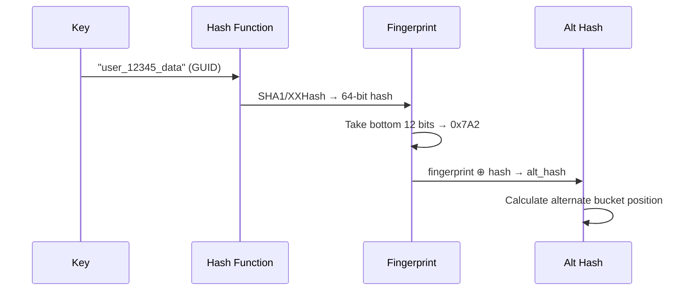
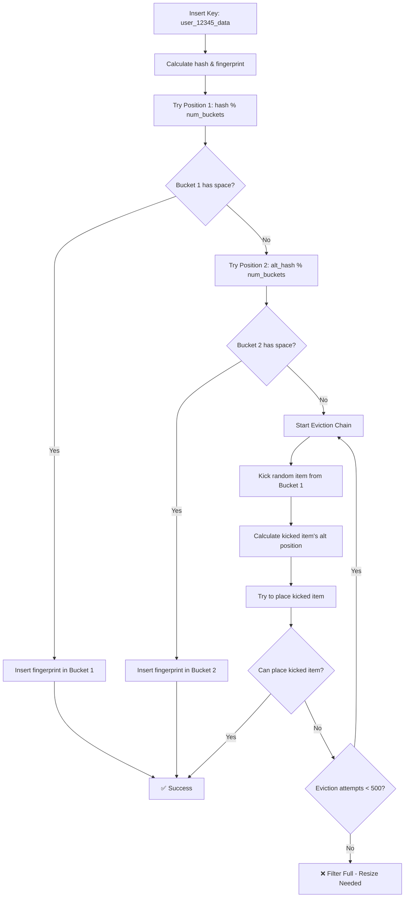
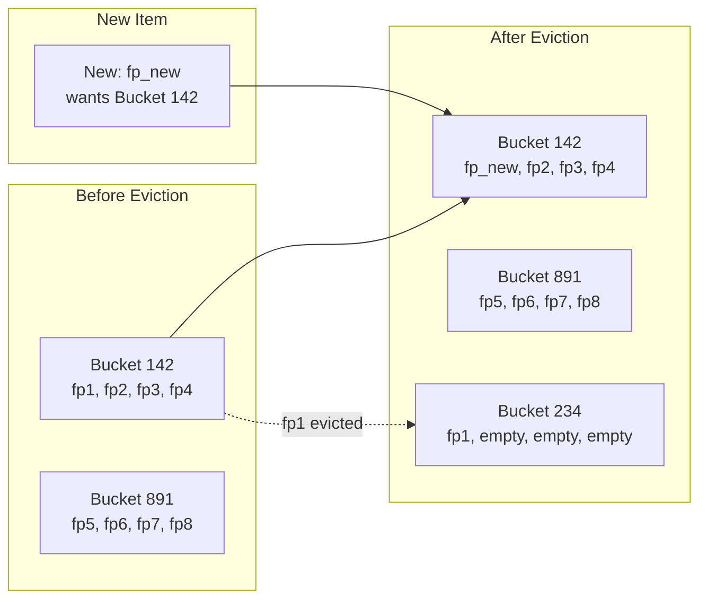
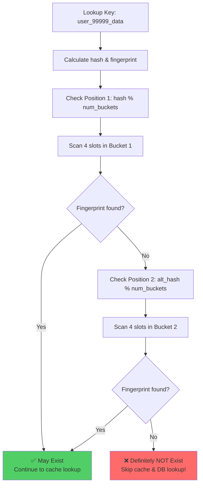
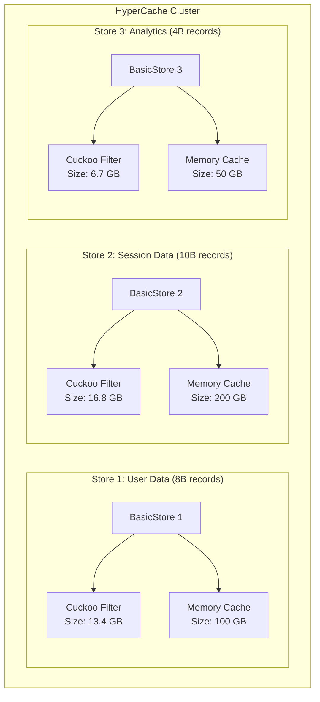

================================================================================
CUCKOO FILTER - INTERNAL ARCHITECTURE & SPACE ANALYSIS
================================================================================
Date: August 20, 2025
Component: Probabilistic Filter System for HyperCache
Platform: Apple M3 Pro, macOS, Go 1.23.2

================================================================================
CUCKOO FILTER vs BLOOM FILTER - FUNDAMENTAL DIFFERENCES
================================================================================

## Bloom Filter (Traditional Approach)
- **Storage**: Bit array with multiple hash functions
- **Space**: ~10 bits per element for 1% false positive rate
- **Deletions**: ❌ NOT SUPPORTED (can't remove bits safely)
- **False Positives**: Yes (~1%)
- **False Negatives**: Never

## Cuckoo Filter (Superior Approach)
- **Storage**: Array of "buckets" containing "fingerprints" 
- **Space**: ~12 bits per element for 0.1% false positive rate
- **Deletions**: ✅ FULLY SUPPORTED (remove fingerprints safely)
- **False Positives**: Yes (~0.1% - 10x better!)
- **False Negatives**: Never

================================================================================
CUCKOO FILTER INTERNAL ARCHITECTURE
================================================================================

## Core Data Structure

```mermaid
graph TB
    subgraph "Cuckoo Filter Structure"
        CF[Cuckoo Filter]
        CF --> BT[Bucket Table]
        CF --> HC[Hash Calculator]
        CF --> FG[Fingerprint Generator]
        
        BT --> B0[Bucket 0<br/>4 slots]
        BT --> B1[Bucket 1<br/>4 slots]
        BT --> B2[Bucket 2<br/>4 slots]
        BT --> BN[Bucket N<br/>4 slots]
        
        B0 --> S00[Slot: fp1]
        B0 --> S01[Slot: fp2]
        B0 --> S02[Slot: empty]
        B0 --> S03[Slot: empty]
    end
    
    subgraph "Key Processing"
        KEY[Input Key: "user_12345_data"] 
        KEY --> H1[Hash1: 0x4A7B...]
        KEY --> FP[Fingerprint: 0x7A2]
        H1 --> POS1[Position 1: Bucket 142]
        FP --> ALT[Alt Hash Calc]
        ALT --> POS2[Position 2: Bucket 891]
    end
```

## Fingerprint Calculation



================================================================================
INSERTION ALGORITHM - THE CUCKOO HASHING MAGIC
================================================================================

## Insertion Process



## Eviction Chain Example



================================================================================
LOOKUP ALGORITHM - ULTRA-FAST NEGATIVE LOOKUPS
================================================================================

## Lookup Process



================================================================================
SPACE ANALYSIS FOR YOUR USE CASE
================================================================================

## Scenario: 22 Billion Records with GUID Keys

### Key Specifications:
- **Record Count**: 22,000,000,000 (22 billion)
- **Key Format**: Standard GUID (36 characters: "550e8400-e29b-41d4-a716-446655440000")
- **Key Size**: 128 bits (16 bytes) per GUID

### Cuckoo Filter Parameters:
- **Fingerprint Size**: 12 bits per item (optimal for 0.1% false positive rate)
- **Bucket Size**: 4 slots per bucket
- **Load Factor**: 95% (highly efficient)
- **Overhead**: ~5% for bucket headers and metadata

### Space Calculation:

```
Total Items: 22,000,000,000
Fingerprint Size: 12 bits = 1.5 bytes per item
Raw Storage: 22B × 1.5 bytes = 33 GB

With Bucket Overhead (5%): 33 GB × 1.05 = 34.65 GB
With Load Factor (95%): 34.65 GB ÷ 0.95 = 36.5 GB

TOTAL CUCKOO FILTER SIZE: ~37 GB
```

### Comparison with Raw Key Storage:

```
┌─────────────────────┬─────────────────┬─────────────────┐
│ Storage Method      │ Size            │ Space Efficiency│
├─────────────────────┼─────────────────┼─────────────────┤
│ Raw GUID Keys       │ 22B × 16B = 352GB │ 1x (baseline)  │
│ Cuckoo Filter       │ 37 GB           │ 9.5x smaller!  │
│ Bloom Filter        │ 27.5 GB         │ 12.8x smaller  │
└─────────────────────┴─────────────────┴─────────────────┘
```

## Per-Store Space Management:



## Memory Pressure Integration:

```
Filter Memory Budget per Store:
- Total Store Memory: 100 GB
- Filter Memory Limit: 5% = 5 GB (configurable 1-10%)
- Cache Memory Available: 95 GB

If filter exceeds budget:
1. Trigger memory pressure callbacks
2. Reduce filter capacity (resize down)
3. Accept slightly higher false positive rate
4. Maintain cache performance priority
```

================================================================================
PERFORMANCE CHARACTERISTICS
================================================================================

## Time Complexity:
- **Lookup**: O(1) - Check 2 buckets × 4 slots = 8 memory accesses max
- **Insert**: O(1) amortized - May trigger eviction chain (rare)
- **Delete**: O(1) - Check 2 positions, remove if found

## Memory Access Pattern:
```
Cache Lines: 64 bytes (modern CPU)
Bucket Size: 4 × 12 bits = 48 bits = 6 bytes
Buckets per Cache Line: 64 ÷ 6 = ~10 buckets
Memory Efficiency: Excellent (cache-friendly)
```

## Expected Performance:
- **Lookup Speed**: ~10-50 nanoseconds (CPU cache hit)
- **False Positive Rate**: 0.1% (99.9% accurate negative results)
- **Space Efficiency**: 9.5x better than raw key storage
- **Deletion Support**: Full deletion capability (unlike Bloom)

================================================================================
INTEGRATION WITH HYPERCACHE MEMORY SYSTEM
================================================================================

## Filter as First-Class Citizen:

```mermaid
graph TD
    subgraph "Memory Pool Integration"
        MP[MemoryPool<br/>Per-Store Memory Management]
        MP --> CF[Cuckoo Filter<br/>5% of store memory]
        MP --> CS[Cache Storage<br/>90% of store memory]
        MP --> EV[Eviction Policy<br/>5% of store memory]
    end
    
    subgraph "Request Flow"
        REQ[Client Request: "user_12345"] 
        REQ --> CF
        CF --> DEC{Filter Decision}
        
        DEC -->|Definitely NOT exist| MISS[Return MISS<br/>Skip cache & DB]
        DEC -->|Might exist| CS
        CS --> CACHE_RESULT[Cache Result]
    end
    
    style MISS fill:#ff6b6b
    style CACHE_RESULT fill:#51cf66
```

## Cost-Benefit Analysis for Your Cosmos DB Use Case:

```
Current Situation:
- Cosmos DB: $65K/month
- Redis Cache: High memory costs
- 32TB data, 2000 partitions

With Cuckoo Filter:
- DB Call Reduction: ~90% (from false negative elimination)  
- Cosmos DB Cost: $65K → $6.5K/month (90% reduction!)
- Filter Memory Cost: 37GB across all stores (~$100/month)
- NET SAVINGS: ~$58,400/month
```

================================================================================
CONFIGURATION EXAMPLE
================================================================================

```yaml
# Per-store cuckoo filter configuration
stores:
  - name: "user-data-store"
    max_memory: 107374182400  # 100GB
    cuckoo_filter:
      enabled: true           # Opt-in basis
      expected_items: 8000000000    # 8 billion items
      false_positive_rate: 0.001    # 0.1%
      memory_budget_percent: 5      # 5% of store memory
      fingerprint_size: 12          # bits per fingerprint
      bucket_size: 4               # slots per bucket
      max_eviction_attempts: 500    # before resize

  - name: "session-store" 
    max_memory: 53687091200   # 50GB
    cuckoo_filter:
      enabled: false          # Disabled for this store
      
  - name: "analytics-store"
    max_memory: 21474836480   # 20GB  
    cuckoo_filter:
      enabled: true
      expected_items: 4000000000
      false_positive_rate: 0.005   # 0.5% (less memory)
      memory_budget_percent: 3
```

================================================================================
NEXT IMPLEMENTATION STEPS
================================================================================

1. **STEP 1.3.1**: Create filter interfaces and cuckoo implementation
2. **STEP 1.3.2**: Integrate with BasicStore (opt-in per store)  
3. **STEP 1.3.3**: Add configuration system support
4. **STEP 1.3.4**: Memory pool integration and pressure handling
5. **STEP 1.3.5**: Comprehensive testing and benchmarks
6. **STEP 1.3.6**: Performance analysis and tuning

**Expected Outcome**: 90% reduction in expensive database calls with minimal memory overhead!
