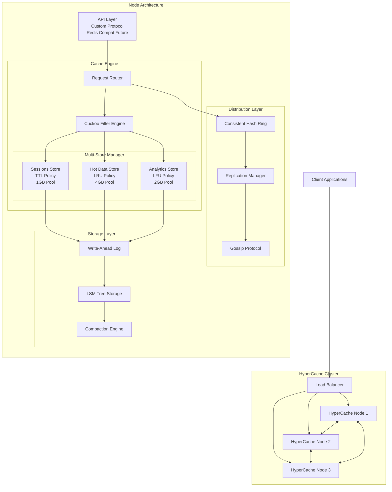
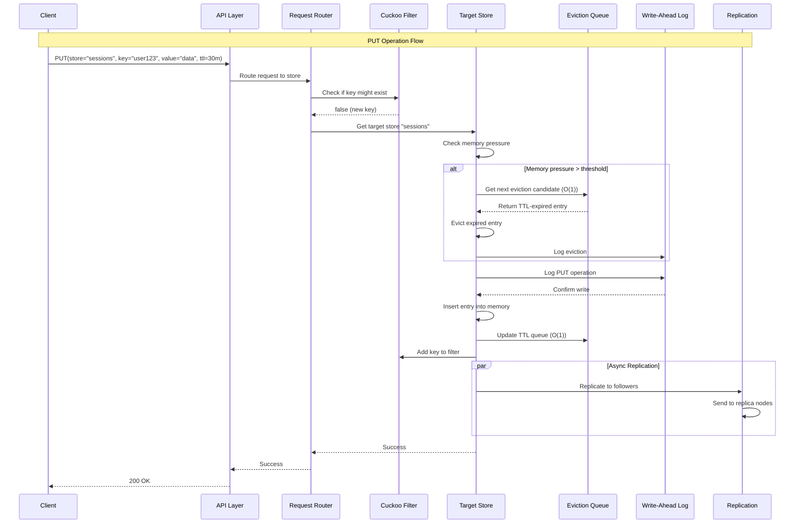
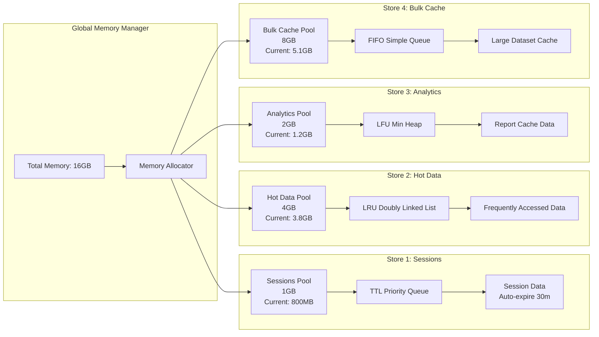
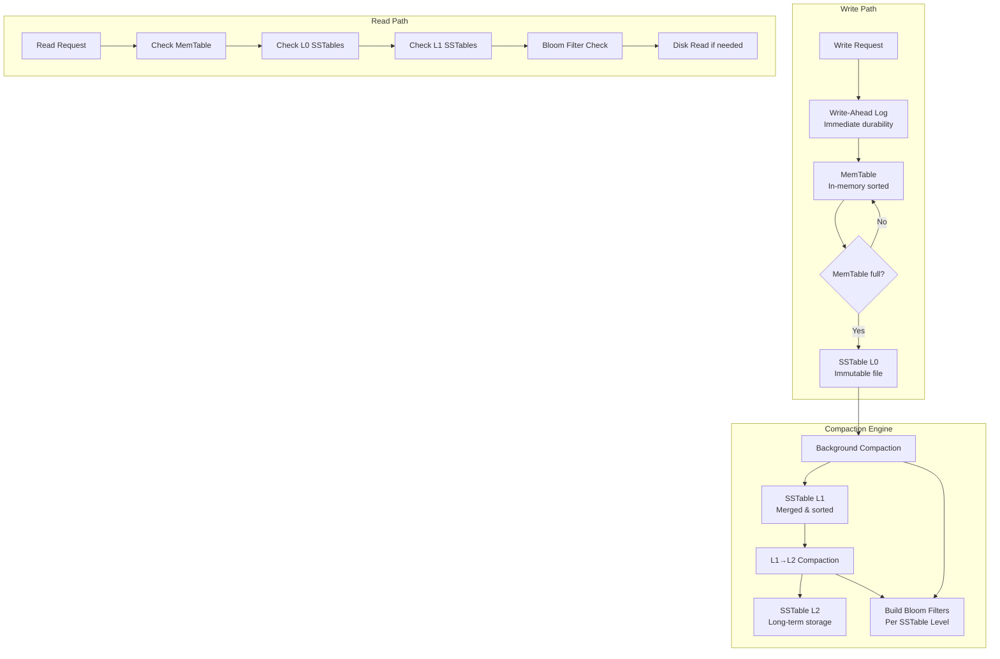

# HyperCache Architecture Diagrams

## 1. System Overview - Component Architecture



## 2. Request Flow - Sequence Diagram



## 3. Multi-Store Memory Management



## 4. Eviction Policy Data Structures (O(1) Operations)

```mermaid
graph TB
    subgraph "LRU Store - O(1) Operations"
        LRU_Hash[HashMap<br/>Key → Node*]
        LRU_List[Doubly Linked List<br/>MRU ← → ← → LRU]
        
        LRU_Hash <--> LRU_List
        
        note1[GET: Move to head O(1)<br/>PUT: Add to head O(1)<br/>EVICT: Remove tail O(1)]
    end
    
    subgraph "LFU Store - O(1) Amortized"
        LFU_Hash[HashMap<br/>Key → FreqNode*]
        LFU_Freq[Frequency Buckets<br/>Min Heap by Frequency]
        
        LFU_Hash <--> LFU_Freq
        
        note2[GET: Increment freq O(1)<br/>PUT: Add with freq=1 O(1)<br/>EVICT: Remove min freq O(1)]
    end
    
    subgraph "TTL Store - O(1) for Expired"
        TTL_Hash[HashMap<br/>Key → Entry*]
        TTL_Pqueue[Priority Queue<br/>Sorted by Expiration]
        
        TTL_Hash <--> TTL_Pqueue
        
        note3[GET: Check expiration O(1)<br/>PUT: Insert with TTL O(log n)<br/>EVICT: Remove expired O(1)]
    end
```

## 5. Distribution & Replication Strategy

```mermaid
graph TB
    subgraph "Consistent Hash Ring"
        Ring((Hash Ring<br/>0 to 2^32))
        
        VN1[Virtual Node 1<br/>Node A]
        VN2[Virtual Node 2<br/>Node A]
        VN3[Virtual Node 3<br/>Node B]
        VN4[Virtual Node 4<br/>Node B]
        VN5[Virtual Node 5<br/>Node C]
        VN6[Virtual Node 6<br/>Node C]
        
        Ring --- VN1
        Ring --- VN2
        Ring --- VN3
        Ring --- VN4
        Ring --- VN5
        Ring --- VN6
    end
    
    subgraph "Replication Strategy"
        Primary[Primary Node<br/>Hash(key) → Node]
        Replica1[Replica 1<br/>Next node clockwise]
        Replica2[Replica 2<br/>Next+1 node clockwise]
        
        Primary --> Replica1
        Primary --> Replica2
        
        note4[Replication Factor: 3<br/>Consistency: Eventual<br/>Read: Any replica<br/>Write: Primary + async replicas]
    end
    
    subgraph "Gossip Protocol"
        NodeA[Node A<br/>Heartbeat every 1s]
        NodeB[Node B<br/>Failure detection]
        NodeC[Node C<br/>Metadata sync]
        
        NodeA <--> NodeB
        NodeB <--> NodeC  
        NodeC <--> NodeA
        
        note5[φ-accrual failure detector<br/>Node join/leave events<br/>Hash ring updates]
    end
```

## 6. Storage Engine Architecture



## Implementation Notes:
- ✅ Multi-store with per-store eviction policies
- ✅ O(1) operations with optimized data structures
- ✅ Basic networking with custom protocol
- ✅ WAL + simple LSM storage
- ✅ Cuckoo filter integration
