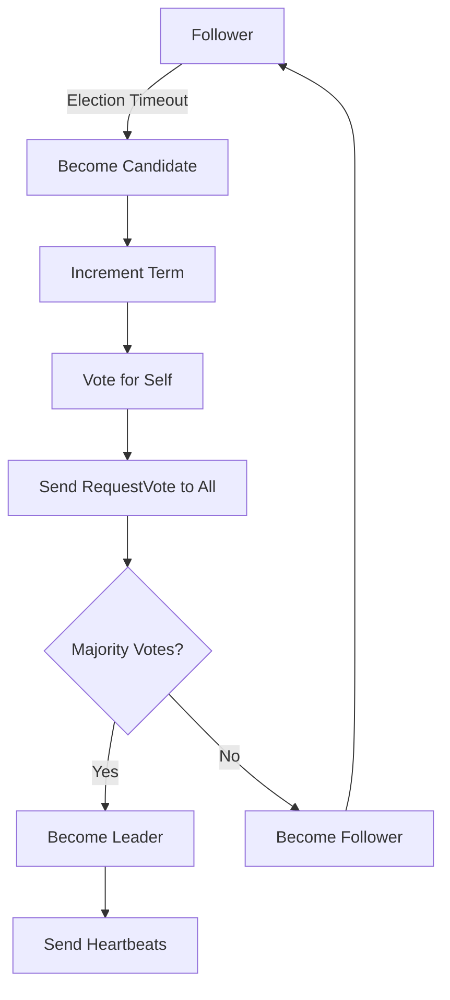

================================================================================
RAFT CONSENSUS ALGORITHM: DEEP DIVE
================================================================================
Project: HyperCache Distributed Cache System
Topic: Understanding Raft Consensus for Distributed Coordination
Date: August 20, 2025

================================================================================
WHAT IS RAFT AND WHY DO WE NEED IT?
================================================================================

## The Distributed Systems Problem

Imagine you have 3 servers storing the same data. A client wants to update a value:
```
Client: "Set key='user:123' to 'John Doe'"

Server A: ✅ Updated
Server B: ❌ Network timeout 
Server C: ✅ Updated

Question: What is the "true" value of key='user:123'?
```

**This is the fundamental problem Raft solves: achieving consensus in distributed systems.**

## What is Consensus?

**Consensus** means all non-faulty servers agree on the same sequence of operations, even when:
- Networks are unreliable (messages lost, delayed, duplicated)
- Servers can crash and recover
- Messages can arrive out of order

## Why Raft vs Other Algorithms?

### Paxos (The Alternative):
- **Pros**: Mathematically proven correct
- **Cons**: Extremely complex to understand and implement correctly

### Raft (Our Choice):
- **Pros**: Designed for understandability, equivalent safety to Paxos
- **Cons**: Slightly more messages in some edge cases (negligible in practice)

**Raft's Goal**: "Consensus algorithm that's as easy to understand as possible"

================================================================================
RAFT CORE CONCEPTS
================================================================================

## 1. Server States

Every server in a Raft cluster is in exactly one of three states:

### 🎯 **Leader**
- **Role**: Handles all client requests, replicates log entries
- **Count**: Exactly 1 per cluster (in normal operation)  
- **Responsibilities**:
  - Accept client requests
  - Replicate log entries to followers
  - Send heartbeats to maintain authority
  - Decide when log entries are committed

### 👥 **Follower**  
- **Role**: Passive, responds to Leader and Candidates
- **Count**: Majority of servers
- **Responsibilities**:
  - Respond to requests from Leaders and Candidates
  - Forward client requests to Leader
  - Vote in elections when requested

### 🗳️ **Candidate**
- **Role**: Temporary state during leader election
- **Count**: 0 or more (during elections)
- **Responsibilities**:
  - Request votes from other servers
  - Transition to Leader if majority votes received
  - Transition back to Follower if another Leader emerges

## 2. Terms (Logical Time)

```
Term 1    Term 2    Term 3    Term 4
├─────────┼─────────┼─────────┼─────────►
│ Leader  │Election │ Leader  │ Leader  │
│   A     │Timeout  │   B     │   C     │
└─────────┴─────────┴─────────┴─────────┘
```

- **Terms** are logical timestamps (monotonically increasing)
- Each term has **at most one leader**
- Terms help detect outdated information
- Servers reject messages from older terms

## 3. The Replicated Log

Every server maintains a replicated log of operations:

```
Server A: [Set x=1][Set y=2][Del x][Set z=3]
          Term: 1    1      2     2     (committed ✅)
          
Server B: [Set x=1][Set y=2][Del x][Set z=3]
          Term: 1    1      2     2     (committed ✅)
          
Server C: [Set x=1][Set y=2][Del x][    ]
          Term: 1    1      2           (not committed ❌)
```

**Key Properties**:
- **Log Matching**: If two logs contain an entry with same index and term, they are identical up to that point
- **Leader Completeness**: A leader must contain all committed entries from previous terms
- **State Machine Safety**: If a server applies a log entry at a given index, no other server will apply a different log entry for the same index

================================================================================
RAFT ALGORITHM PHASES
================================================================================

## Phase 1: Leader Election

### When Elections Happen:
- **Startup**: No leader exists
- **Leader Failure**: Followers don't receive heartbeats
- **Network Partition**: Servers can't communicate with leader

### Election Process:



### Election Timeout Randomization:
```
Server A: Timeout = 150ms + random(0-150ms) = 220ms
Server B: Timeout = 150ms + random(0-150ms) = 180ms ← Likely to win
Server C: Timeout = 150ms + random(0-150ms) = 280ms
```

**Why Random?** Prevents multiple servers from becoming candidates simultaneously.

### RequestVote RPC:
```go
type RequestVoteArgs struct {
    Term         int    // Candidate's term
    CandidateId  int    // Candidate requesting vote  
    LastLogIndex int    // Index of candidate's last log entry
    LastLogTerm  int    // Term of candidate's last log entry
}

type RequestVoteReply struct {
    Term        int   // Current term for candidate to update itself
    VoteGranted bool  // True means candidate received vote
}
```

### Voting Rules:
A server votes for a candidate if:
1. **Term is valid**: Candidate's term ≥ server's current term
2. **Haven't voted**: Server hasn't voted for anyone else in this term
3. **Log is up-to-date**: Candidate's log is at least as up-to-date as server's log

## Phase 2: Log Replication

### Normal Operation Flow:

```
Client Request
      ↓
   Leader              Followers
      ↓                   ↑
  Add to Log    ────────────┘
      ↓         AppendEntries
  Wait for      ←────────────┐
  Majority              Success/Fail
      ↓                   
  Commit Entry
      ↓
  Apply to State
      ↓
  Reply to Client
```

### AppendEntries RPC:
```go
type AppendEntriesArgs struct {
    Term         int        // Leader's term
    LeaderId     int        // Leader's ID (for followers to redirect clients)
    PrevLogIndex int        // Index of log entry immediately preceding new ones
    PrevLogTerm  int        // Term of prevLogIndex entry
    Entries      []LogEntry // Log entries to store (empty for heartbeat)
    LeaderCommit int        // Leader's commitIndex
}

type AppendEntriesReply struct {
    Term    int  // Current term, for leader to update itself  
    Success bool // True if follower contained entry matching prevLogIndex and prevLogTerm
}
```

### Log Consistency Check:
Before adding new entries, followers verify:
1. **Term Match**: Leader's term ≥ follower's term
2. **Log Match**: Entry at `prevLogIndex` has term `prevLogTerm`

If check fails → **Reject** (Leader will retry with earlier index)

### Commit Rules:
An entry is **committed** when:
1. **Stored on majority** of servers
2. **Leader commits entries** from current term
3. **Transitivity**: Committing an entry also commits all previous entries

## Phase 3: Safety & Edge Cases

### The Split-Brain Problem

**Scenario**: Network partition splits cluster:

```
Original Cluster: [A, B, C, D, E] (Leader: A)
                        ↓
                  Network Partition
                        ↓
Partition 1: [A, B] (Leader: A thinks it's still leader)
Partition 2: [C, D, E] (Elect new leader, say C)

Problem: Two leaders! Which writes are valid?
```

**Raft's Solution**: **Majority Quorum**
- Leader must communicate with majority to commit entries
- A (2/5) cannot commit new entries
- C (3/5) can commit new entries  
- Only one partition can make progress

### Log Conflicts and Resolution

**Scenario**: Inconsistent logs after leader failure:

```
Term: 1 2 3 4 5 6
   A: 1 2 3
   B: 1 2 3 4
   C: 1 2   4 5
   D: 1 2   4 5 6

New Leader (D) must make all logs identical
```

**Resolution Process**:
1. **Find Conflict Point**: Leader decrements nextIndex until match found
2. **Overwrite Conflicts**: Followers delete conflicting entries
3. **Replicate Missing**: Leader sends all entries from conflict point onward

### The "Hole in Log" Problem

**Problem**: What if leader crashes before committing an entry?

```
Term 1: Leader A replicates entry to B, C but crashes before committing
Term 2: Leader B could have different entry at same index
```

**Raft's Solution**: **Only commit entries from current term**
- New leader never directly commits entries from previous terms  
- Previous entries get committed indirectly when new entry is committed

================================================================================
RAFT IN PRACTICE: COMMON PATTERNS
================================================================================

## 1. Cluster Membership Changes

**Challenge**: How to safely add/remove servers?

**Naive Approach (Dangerous)**:
```
Old Config: [A, B, C] → New Config: [A, B, C, D, E]
```
Could result in two leaders during transition!

**Raft's Solution: Joint Consensus**:
```
Phase 1: [A,B,C] → [A,B,C,D,E] (Joint: need majority of both)
Phase 2: [A,B,C,D,E] (New: need majority of new config)
```

## 2. Log Compaction (Snapshots)

**Problem**: Logs grow unbounded over time

**Solution**: Periodic snapshots
```
Original Log: [1][2][3][4][5][6][7][8][9][10]
                  ↓ Snapshot at index 5
Compacted:    [Snapshot:1-5][6][7][8][9][10]
```

**InstallSnapshot RPC**: Transfer snapshots to slow followers

## 3. Optimization Techniques

### Batching:
```
Instead of: AppendEntries([entry1]), AppendEntries([entry2])
Do:         AppendEntries([entry1, entry2, entry3])
```

### Pipelining:
```
Don't wait for reply before sending next batch
Send: Batch1 → Batch2 → Batch3
Recv:   ack1 ←   ack2 ←   ack3
```

### Efficient Conflict Resolution:
```go
type AppendEntriesReply struct {
    // ... existing fields
    ConflictIndex int  // First index with conflicting term
    ConflictTerm  int  // Term of conflicting entry
}
```

================================================================================
SPLIT-BRAIN PREVENTION DEEP DIVE
================================================================================

## What is Split-Brain?

**Split-Brain** occurs when multiple servers believe they are the leader simultaneously, leading to:
- **Inconsistent State**: Different leaders accept different writes
- **Data Corruption**: Conflicting updates to same keys
- **Availability Issues**: Clients see different data depending on which leader they contact

## Real-World Split-Brain Scenario

```
HyperCache Cluster: [Node A, Node B, Node C]
Initial State: Node A is leader, all nodes have same data

Network Partition:
┌─────────────┐     ┌─────────────────────┐
│   Node A    │ ❌  │   Node B, Node C   │
│  (Leader)   │     │                    │  
│             │     │                    │
└─────────────┘     └─────────────────────┘

What happens?

Node A side:
- Thinks it's still leader
- Cannot reach majority (1/3)
- Cannot commit new operations
- Enters "read-only" mode

Node B,C side:  
- Detect leader failure (no heartbeats)
- Start election
- Node B becomes leader (2/3 majority)
- Can commit new operations
```

## How Raft Prevents Split-Brain

### 1. **Majority Quorum Rule**
```
For cluster of N nodes:
- Majority = (N/2) + 1
- Only ONE partition can have majority
- Only majority partition can elect leader and commit operations

Examples:
- 3 nodes: majority = 2, partitions could be (1,2) → only group of 2 can operate
- 5 nodes: majority = 3, partitions could be (2,3) → only group of 3 can operate  
- 7 nodes: majority = 4, partitions could be (3,4) → only group of 4 can operate
```

### 2. **Term Numbers (Logical Timestamps)**
```
Every leader election increments term number:

Timeline:
Term 1: Node A is leader
Term 2: Network partition, Node B elected in majority partition  
Term 3: Network heals, all nodes recognize Term 3

Rule: Nodes reject messages from older terms
Result: Old "leader" (Node A with Term 1) is ignored
```

### 3. **Heartbeat Mechanism**
```
Leader sends periodic heartbeats:
- Interval: 50ms (configurable)
- Timeout: 150-300ms (randomized)

If followers don't receive heartbeat within timeout:
→ Assume leader failed
→ Start election
```

### 4. **Leader Step-Down**
```
If current leader receives message with higher term:
→ Immediately step down to follower
→ Update to new term
→ Participate in new leader's consensus

This ensures automatic recovery when partition heals
```

## Advanced Split-Brain Scenarios

### Scenario 1: "Flapping Leader"
```
Problem: Network is unstable, leader keeps changing

Term 1: A is leader
Term 2: B is leader  
Term 3: A is leader again
Term 4: C is leader

Solution: 
- Pre-vote phase (optional extension)
- Exponential backoff for election timeouts
- Network stability requirements
```

### Scenario 2: "Byzantine Failures"
```
Problem: Malicious or corrupted nodes send conflicting messages

Raft Assumption: "Fail-stop" failures only
- Nodes either work correctly or crash
- Does NOT handle arbitrary/malicious failures

For Byzantine tolerance: Need different algorithms (PBFT, Tendermint)
```

### Scenario 3: "Clock Skew"
```
Problem: Server clocks are significantly different

Raft Solution: Uses logical time (terms), not wall-clock time
- Election timeouts based on message counts, not absolute time
- Log ordering based on terms and indices, not timestamps
```

================================================================================
RAFT IMPLEMENTATION CONSIDERATIONS
================================================================================

## State Persistence

**Must Persist** (survive crashes):
```go
type PersistentState struct {
    CurrentTerm int        // Latest term server has seen
    VotedFor    *int       // CandidateId that received vote in current term  
    Log         []LogEntry // Log entries
}
```

**Can Be Volatile** (lost on crash):
```go
type VolatileState struct {
    CommitIndex int // Index of highest log entry known to be committed
    LastApplied int // Index of highest log entry applied to state machine
    
    // Leader state (reinitialized after election)
    NextIndex  []int // For each server, index of next log entry to send
    MatchIndex []int // For each server, index of highest log entry replicated
}
```

## Performance Tuning

### Election Timeouts:
```
Too Short: Frequent unnecessary elections
Too Long:  Slow failure detection

Sweet Spot: 150-300ms randomized
```

### Heartbeat Intervals:
```
Rule of Thumb: Heartbeat interval << Election timeout

Typical: 50ms heartbeat, 150-300ms election timeout
```

### Batch Sizes:
```
Too Small: High message overhead
Too Large:  High latency, memory usage

Sweet Spot: 1000-10000 entries per batch
```

## Error Handling Patterns

### Network Errors:
```go
func sendAppendEntries(server int, args *AppendEntriesArgs) {
    for retries := 0; retries < maxRetries; retries++ {
        reply, err := rpc.Call(server, "Raft.AppendEntries", args)
        if err == nil {
            // Success, process reply
            return
        }
        
        // Exponential backoff
        time.Sleep(baseDelay << retries)
    }
    
    // Mark server as unreachable, update routing tables
}
```

### Log Conflicts:
```go
if !reply.Success {
    // Conflict detected, backtrack
    nextIndex[server]--
    // Could optimize with ConflictIndex/ConflictTerm
}
```

================================================================================
TESTING RAFT IMPLEMENTATIONS
================================================================================

## Unit Tests
- Leader election under various scenarios
- Log replication with different network conditions  
- State persistence and recovery
- Edge cases (split votes, duplicate messages)

## Integration Tests
- Multi-node cluster formation
- Network partition scenarios
- Leader failure and recovery
- Membership changes

## Chaos Testing
- Random network failures
- Random server crashes  
- Clock drift simulation
- Message delays and reordering

## Performance Tests  
- Throughput under normal operation
- Latency during leadership changes
- Resource usage (CPU, memory, network)
- Scalability with cluster size

================================================================================
RAFT vs ALTERNATIVES COMPARISON
================================================================================

| Algorithm | Understandability | Performance | Fault Tolerance | Complexity |
|-----------|------------------|-------------|-----------------|------------|
| **Raft**  | ⭐⭐⭐⭐⭐        | ⭐⭐⭐⭐      | ⭐⭐⭐⭐          | ⭐⭐         |
| Paxos     | ⭐                | ⭐⭐⭐⭐⭐    | ⭐⭐⭐⭐⭐        | ⭐⭐⭐⭐⭐    |
| PBFT      | ⭐⭐               | ⭐⭐         | ⭐⭐⭐⭐⭐        | ⭐⭐⭐⭐⭐    |
| Gossip    | ⭐⭐⭐             | ⭐⭐⭐⭐⭐    | ⭐⭐⭐           | ⭐⭐⭐       |

**Why Raft for HyperCache?**
- ✅ **Understandable**: We can implement and debug it correctly
- ✅ **Good Performance**: Suitable for cache coordination workloads  
- ✅ **Proven**: Used in etcd, Consul, MongoDB, CockroachDB
- ✅ **Right Fit**: Cache metadata coordination doesn't need Byzantine tolerance

================================================================================
NEXT STEPS FOR HYPERCACHE
================================================================================

## Raft Usage in HyperCache

**What Raft Will Manage**:
- ✅ **Cluster Membership**: Which nodes are in the cluster
- ✅ **Configuration Changes**: Adding/removing nodes, changing settings
- ✅ **Metadata Operations**: Namespace creation, access control changes
- ✅ **Rebalancing Decisions**: When to move data between nodes

**What Raft Will NOT Manage**:
- ❌ **Cache Data**: Individual GET/SET operations (too high volume)
- ❌ **Replication**: Data replication uses separate async protocol
- ❌ **Client Sessions**: Managed locally for performance

## Implementation Priority

1. **Leader Election**: Basic cluster coordination
2. **Log Replication**: Cluster membership and configuration management  
3. **Snapshots**: Handle long-running clusters with configuration history
4. **Optimizations**: Batching, pipelining, efficient conflict resolution

**Ready to implement!** With this understanding, we can build a robust distributed cache that handles failures gracefully and prevents split-brain scenarios.
