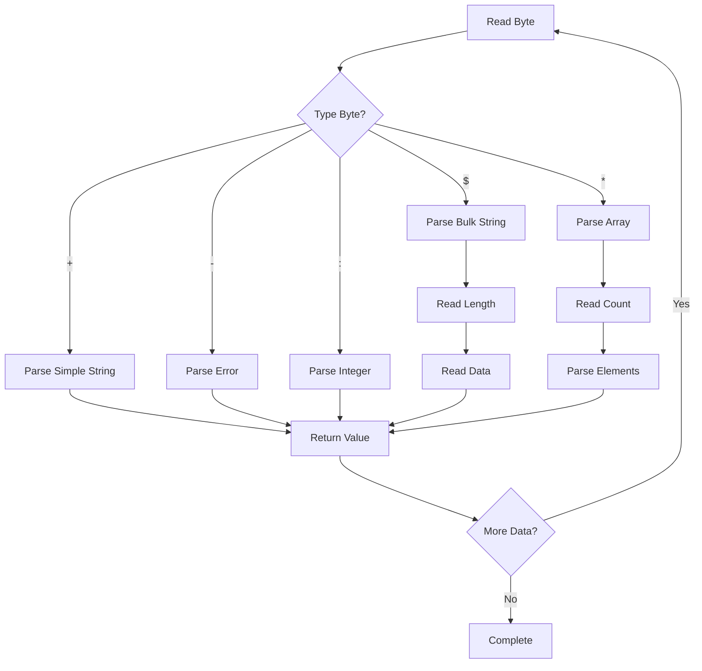
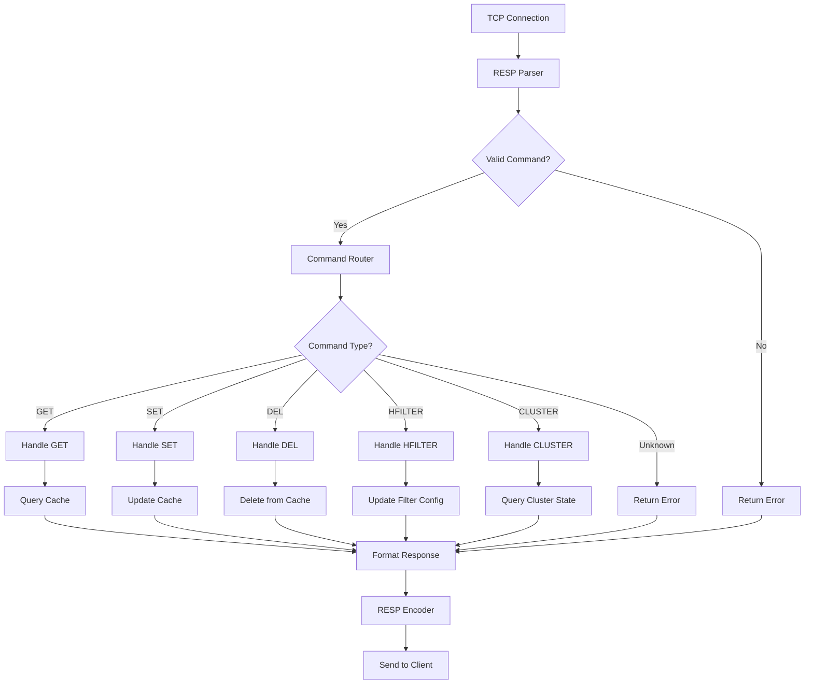

================================================================================
REDIS PROTOCOL (RESP) SPECIFICATION & IMPLEMENTATION
================================================================================
Project: HyperCache Distributed Cache System  
Topic: Understanding and Implementing Redis Serialization Protocol
Date: August 20, 2025

================================================================================
WHAT IS RESP AND WHY USE IT?
================================================================================

## Redis Serialization Protocol (RESP)

**RESP** is the communication protocol used by Redis clients and servers. It's:
- ✅ **Simple**: Easy to parse and implement
- ✅ **Human Readable**: You can debug with telnet
- ✅ **Efficient**: Minimal overhead for common operations
- ✅ **Extensible**: Easy to add new data types
- ✅ **Battle-Tested**: Handles millions of operations per second in production

## Why RESP for HyperCache?

### Ecosystem Benefits:
```
Existing Redis Clients (All Languages):
- Python: redis-py, hiredis  
- Java: jedis, lettuce
- Node.js: node_redis, ioredis
- Go: go-redis, redigo
- C#: StackExchange.Redis
- Ruby: redis-rb
- PHP: phpredis
- Rust: redis-rs
- And 50+ more...
```

### Drop-in Replacement Potential:
```python
# Existing Redis code:
import redis
client = redis.Redis(host='redis-server', port=6379)
client.set('key', 'value')

# HyperCache - NO CODE CHANGE needed:
client = redis.Redis(host='hypercache-server', port=6379)
client.set('key', 'value')  # Works identically!
```

### Tooling Compatibility:
- **Redis CLI**: `redis-cli -h hypercache-server`  
- **RedisInsight**: GUI management and monitoring
- **Grafana Dashboards**: Existing Redis monitoring
- **Load Testing Tools**: redis-benchmark, memtier

================================================================================
RESP DATA TYPES AND ENCODING
================================================================================

## Core Data Types

RESP has 5 fundamental data types, each prefixed with a type indicator:

### 1. **Simple Strings** - `+`
Used for: Status messages, simple replies
```
Format: +{string}\r\n
Example: +OK\r\n
```

### 2. **Errors** - `-`  
Used for: Error messages
```
Format: -{error message}\r\n
Example: -ERR unknown command\r\n
```

### 3. **Integers** - `:`
Used for: Numeric values, counts, boolean results
```
Format: :{number}\r\n
Examples: 
:42\r\n          → 42
:0\r\n           → 0 (false)  
:1\r\n           → 1 (true)
:-100\r\n        → -100
```

### 4. **Bulk Strings** - `$`
Used for: Binary-safe strings, cache values, keys
```
Format: ${length}\r\n{data}\r\n
Examples:
$5\r\nhello\r\n      → "hello"
$0\r\n\r\n           → "" (empty string)
$-1\r\n              → null
```

### 5. **Arrays** - `*`
Used for: Commands, multi-value responses
```
Format: *{count}\r\n{element1}{element2}...
Example: *3\r\n$3\r\nSET\r\n$3\r\nkey\r\n$5\r\nvalue\r\n
         → ["SET", "key", "value"]
```

## RESP Parsing Rules

### Line Endings:
- **Always**: `\r\n` (CRLF)
- **Never**: `\n` alone or `\r` alone

### Binary Safety:
- Bulk Strings can contain any byte sequence (including `\r\n`)
- Length prefix ensures proper parsing

### Null Values:
- `$-1\r\n` represents null/nil
- `*-1\r\n` represents null array

================================================================================
COMMON REDIS COMMANDS IN RESP
================================================================================

## Basic Operations

### GET Command
```
Client → Server:
*2\r\n$3\r\nGET\r\n$7\r\nmykey\r\n

Translation: ["GET", "mykey"]

Server → Client (if key exists):
$11\r\nhello world\r\n

Server → Client (if key doesn't exist):
$-1\r\n
```

### SET Command
```
Client → Server:
*3\r\n$3\r\nSET\r\n$7\r\nmykey\r\n$11\r\nhello world\r\n

Translation: ["SET", "mykey", "hello world"]

Server → Client:
+OK\r\n
```

### DEL Command
```
Client → Server:  
*2\r\n$3\r\nDEL\r\n$7\r\nmykey\r\n

Translation: ["DEL", "mykey"]

Server → Client:
:1\r\n  (1 key deleted)
```

### EXISTS Command
```
Client → Server:
*2\r\n$6\r\nEXISTS\r\n$7\r\nmykey\r\n

Translation: ["EXISTS", "mykey"]

Server → Client:
:1\r\n  (key exists)
:0\r\n  (key doesn't exist)
```

## Advanced Operations

### EXPIRE Command (TTL)
```
Client → Server:
*3\r\n$6\r\nEXPIRE\r\n$7\r\nmykey\r\n$3\r\n300\r\n

Translation: ["EXPIRE", "mykey", "300"]  # 300 seconds TTL

Server → Client:
:1\r\n  (timeout set)
:0\r\n  (key doesn't exist)
```

### TTL Command
```
Client → Server:
*2\r\n$3\r\nTTL\r\n$7\r\nmykey\r\n

Server → Client:
:295\r\n    (295 seconds remaining)
:-1\r\n     (no timeout set)
:-2\r\n     (key doesn't exist)
```

### PING Command  
```
Client → Server:
*1\r\n$4\r\nPING\r\n

Server → Client:
+PONG\r\n
```

### INFO Command
```
Client → Server:
*1\r\n$4\r\nINFO\r\n

Server → Client:
$200\r\n# Server\r\nredis_version:7.0.0\r\n# Memory\r\nused_memory:1024000\r\n# Stats\r\ntotal_commands_processed:1000\r\n\r\n
```

================================================================================
HYPERCACHE CUSTOM RESP EXTENSIONS
================================================================================

## HyperCache-Specific Commands

### HFILTER - Toggle Cuckoo Filter
```
Enable Filter:
*3\r\n$7\r\nHFILTER\r\n$7\r\nmystore\r\n$6\r\nenable\r\n
→ ["HFILTER", "mystore", "enable"]

Response: +OK\r\n

Disable Filter:  
*3\r\n$7\r\nHFILTER\r\n$7\r\nmystore\r\n$7\r\ndisable\r\n
→ ["HFILTER", "mystore", "disable"]

Response: +OK\r\n

Query Filter Status:
*2\r\n$7\r\nHFILTER\r\n$7\r\nmystore\r\n  
→ ["HFILTER", "mystore"]

Response: 
:1\r\n  (enabled)
:0\r\n  (disabled)
```

### HSTATS - Store Statistics
```
Client → Server:
*2\r\n$6\r\nHSTATS\r\n$7\r\nmystore\r\n
→ ["HSTATS", "mystore"]

Server → Client:
*12\r\n
$4\r\nkeys\r\n:1000\r\n
$8\r\nmemory_kb\r\n:2048\r\n  
$8\r\nhit_ratio\r\n$4\r\n0.95\r\n
$13\r\nevictions_total\r\n:150\r\n
$12\r\nfilter_enabled\r\n:1\r\n
$17\r\nfilter_false_positives\r\n:5\r\n

Translation: {
  "keys": 1000,
  "memory_kb": 2048,
  "hit_ratio": "0.95", 
  "evictions_total": 150,
  "filter_enabled": 1,
  "filter_false_positives": 5
}
```

### CLUSTER - Cluster Management  
```
Get Cluster Info:
*2\r\n$7\r\nCLUSTER\r\n$4\r\nINFO\r\n
→ ["CLUSTER", "INFO"]

Response:
$150\r\ncluster_state:ok\r\ncluster_slots_assigned:16384\r\ncluster_known_nodes:3\r\ncluster_size:3\r\ncluster_current_epoch:6\r\n\r\n

Get Cluster Nodes:
*2\r\n$7\r\nCLUSTER\r\n$5\r\nNODES\r\n  
→ ["CLUSTER", "NODES"]

Response:
$200\r\n07c37dfeb235213a872192d90877d0cd55635b91 192.168.1.1:7000 master - 0 1658389200000 1 connected 0-5460\r\n279c37dfeb235213a872192d90877d0cd55635b92 192.168.1.2:7000 master - 0 1658389201000 2 connected 5461-10922\r\n\r\n
```

================================================================================
RESP IMPLEMENTATION ARCHITECTURE
================================================================================

## Parser State Machine

```go
type RESPParser struct {
    buf    []byte    // Input buffer
    pos    int       // Current position
    state  ParseState // Current parsing state
}

type ParseState int
const (
    ExpectType ParseState = iota
    ExpectSimpleString
    ExpectError
    ExpectInteger  
    ExpectBulkStringLength
    ExpectBulkStringData
    ExpectArrayLength
    ExpectArrayElement
)
```

## High-Level Parsing Flow



## Core Parsing Functions

### Simple String Parser:
```go
func parseSimpleString(parser *RESPParser) (string, error) {
    start := parser.pos
    for parser.pos < len(parser.buf) {
        if parser.buf[parser.pos] == '\r' && 
           parser.pos+1 < len(parser.buf) && 
           parser.buf[parser.pos+1] == '\n' {
            
            result := string(parser.buf[start:parser.pos])
            parser.pos += 2 // Skip \r\n
            return result, nil
        }
        parser.pos++
    }
    return "", ErrIncompleteData
}
```

### Bulk String Parser:
```go
func parseBulkString(parser *RESPParser) ([]byte, error) {
    // Parse length
    lengthStr, err := parseSimpleString(parser)
    if err != nil {
        return nil, err
    }
    
    length, err := strconv.Atoi(lengthStr)
    if err != nil {
        return nil, ErrInvalidLength
    }
    
    // Handle null
    if length == -1 {
        return nil, nil
    }
    
    // Parse data
    if parser.pos+length+2 > len(parser.buf) {
        return nil, ErrIncompleteData  
    }
    
    result := parser.buf[parser.pos:parser.pos+length]
    parser.pos += length + 2 // Skip data + \r\n
    return result, nil
}
```

### Array Parser:
```go
func parseArray(parser *RESPParser) ([]interface{}, error) {
    // Parse count
    countStr, err := parseSimpleString(parser)
    if err != nil {
        return nil, err
    }
    
    count, err := strconv.Atoi(countStr)
    if err != nil {
        return nil, ErrInvalidCount
    }
    
    // Handle null array
    if count == -1 {
        return nil, nil
    }
    
    // Parse elements
    result := make([]interface{}, count)
    for i := 0; i < count; i++ {
        element, err := parseValue(parser) // Recursive
        if err != nil {
            return nil, err
        }
        result[i] = element
    }
    
    return result, nil
}
```

================================================================================
RESP COMMAND PROCESSING PIPELINE
================================================================================

## Command Execution Flow



## Command Interface Design

```go
type Command interface {
    Name() string
    Execute(ctx context.Context, args [][]byte) RESPValue
    Validate(args [][]byte) error
}

type RESPValue interface {
    Encode() []byte
}

// Standard Redis commands
type GetCommand struct {
    cache CacheEngine
}

func (c *GetCommand) Execute(ctx context.Context, args [][]byte) RESPValue {
    if len(args) != 1 {
        return ErrorValue("wrong number of arguments for 'get' command")
    }
    
    key := string(args[0])
    value, exists := c.cache.Get(key)
    
    if !exists {
        return NullBulkString()
    }
    
    return BulkString(value)
}

// HyperCache extensions  
type HFilterCommand struct {
    cache CacheEngine
}

func (c *HFilterCommand) Execute(ctx context.Context, args [][]byte) RESPValue {
    if len(args) < 1 {
        return ErrorValue("wrong number of arguments for 'hfilter' command")
    }
    
    storeName := string(args[0])
    
    if len(args) == 1 {
        // Query filter status
        enabled := c.cache.IsFilterEnabled(storeName)
        if enabled {
            return IntegerValue(1)
        }
        return IntegerValue(0)
    }
    
    if len(args) == 2 {
        action := string(args[1])
        switch action {
        case "enable":
            err := c.cache.EnableFilter(storeName)
            if err != nil {
                return ErrorValue(err.Error())
            }
            return SimpleString("OK")
        case "disable":
            err := c.cache.DisableFilter(storeName)  
            if err != nil {
                return ErrorValue(err.Error())
            }
            return SimpleString("OK")
        default:
            return ErrorValue("invalid action, use 'enable' or 'disable'")
        }
    }
    
    return ErrorValue("wrong number of arguments for 'hfilter' command")
}
```

## Response Encoding

```go
type SimpleStringValue struct {
    value string
}

func (s SimpleStringValue) Encode() []byte {
    return []byte(fmt.Sprintf("+%s\r\n", s.value))
}

type BulkStringValue struct {
    value []byte
}

func (b BulkStringValue) Encode() []byte {
    if b.value == nil {
        return []byte("$-1\r\n")
    }
    return []byte(fmt.Sprintf("$%d\r\n%s\r\n", len(b.value), b.value))
}

type IntegerValue struct {
    value int64
}

func (i IntegerValue) Encode() []byte {
    return []byte(fmt.Sprintf(":%d\r\n", i.value))
}

type ArrayValue struct {
    elements []RESPValue
}

func (a ArrayValue) Encode() []byte {
    if a.elements == nil {
        return []byte("*-1\r\n")
    }
    
    result := []byte(fmt.Sprintf("*%d\r\n", len(a.elements)))
    for _, element := range a.elements {
        result = append(result, element.Encode()...)
    }
    return result
}
```

================================================================================
PERFORMANCE OPTIMIZATIONS
================================================================================

## Parsing Optimizations

### Streaming Parser:
```go
type StreamingRESPParser struct {
    reader   io.Reader
    buffer   []byte
    commands chan Command
    errors   chan error
}

func (p *StreamingRESPParser) Start() {
    go func() {
        for {
            command, err := p.parseNextCommand()
            if err != nil {
                p.errors <- err
                continue
            }
            p.commands <- command
        }
    }()
}
```

### Zero-Copy String Operations:
```go
// Instead of: string(buffer[start:end])
// Use:        unsafe string view for read-only operations

func bytesToString(b []byte) string {
    return *(*string)(unsafe.Pointer(&b))
}
```

### Buffer Pool:
```go
var bufferPool = sync.Pool{
    New: func() interface{} {
        return make([]byte, 4096)
    },
}

func getBuf() []byte {
    return bufferPool.Get().([]byte)
}

func putBuf(buf []byte) {
    bufferPool.Put(buf)
}
```

## Connection Management

### Connection Pooling:
```go
type ConnectionPool struct {
    mu    sync.RWMutex
    conns map[string]*Connection
    maxIdle int
    maxActive int
}

func (p *ConnectionPool) Get(addr string) (*Connection, error) {
    p.mu.RLock()
    conn, exists := p.conns[addr]
    p.mu.RUnlock()
    
    if exists && conn.IsAlive() {
        return conn, nil
    }
    
    return p.createConnection(addr)
}
```

### Pipelining Support:
```go
type Pipeline struct {
    commands []Command
    results  []RESPValue
}

func (p *Pipeline) Add(cmd Command) {
    p.commands = append(p.commands, cmd)
}

func (p *Pipeline) Execute() error {
    // Send all commands at once
    for _, cmd := range p.commands {
        sendCommand(cmd)
    }
    
    // Read all responses
    for i := range p.commands {
        result, err := readResponse()
        if err != nil {
            return err
        }
        p.results[i] = result
    }
    
    return nil
}
```

================================================================================
ERROR HANDLING AND EDGE CASES
================================================================================

## Common Error Scenarios

### Incomplete Data:
```go
// Client sends: *3\r\n$3\r\nSET\r\n$3\r\nkey\r\n$5\r\nval
// Missing: "ue\r\n"

func handleIncompleteData(parser *RESPParser) error {
    // Buffer the partial command
    parser.partialCommand = append(parser.partialCommand, parser.currentBuffer...)
    
    // Wait for more data
    return ErrNeedMoreData
}
```

### Invalid Protocol:
```go  
// Client sends: INVALID_DATA_HERE

func validateRESPMessage(data []byte) error {
    if len(data) == 0 {
        return ErrEmptyMessage
    }
    
    switch data[0] {
    case '+', '-', ':', '$', '*':
        return nil
    default:
        return ErrInvalidTypeIndicator
    }
}
```

### Memory Exhaustion:
```go
const MaxBulkStringSize = 512 * 1024 * 1024 // 512MB
const MaxArrayElements = 1024 * 1024         // 1M elements

func parseBulkString(parser *RESPParser) ([]byte, error) {
    length, err := parseLength(parser)
    if err != nil {
        return nil, err
    }
    
    if length > MaxBulkStringSize {
        return nil, ErrMessageTooLarge
    }
    
    // ... continue parsing
}
```

### Connection Timeouts:
```go
func handleConnection(conn net.Conn) {
    // Set read timeout  
    conn.SetReadDeadline(time.Now().Add(30 * time.Second))
    
    // Set write timeout
    conn.SetWriteDeadline(time.Now().Add(10 * time.Second))
    
    defer func() {
        conn.Close()
        // Clean up connection state
    }()
    
    // Process commands...
}
```

================================================================================
TESTING RESP IMPLEMENTATION
================================================================================

## Unit Tests

### Parser Tests:
```go
func TestSimpleStringParsing(t *testing.T) {
    tests := []struct {
        input    string
        expected string
        hasError bool
    }{
        {"+OK\r\n", "OK", false},
        {"+Hello World\r\n", "Hello World", false},
        {"+\r\n", "", false},
        {"+OK", "", true}, // Missing \r\n
        {"+OK\n", "", true}, // Missing \r
    }
    
    for _, test := range tests {
        result, err := parseSimpleString([]byte(test.input))
        assert.Equal(t, test.expected, result)
        assert.Equal(t, test.hasError, err != nil)
    }
}
```

### Command Tests:
```go
func TestGetCommand(t *testing.T) {
    cache := NewMockCache()
    cache.Set("mykey", []byte("myvalue"))
    
    cmd := &GetCommand{cache: cache}
    
    // Test existing key
    result := cmd.Execute(context.Background(), [][]byte{[]byte("mykey")})
    assert.Equal(t, "myvalue", string(result.(*BulkStringValue).value))
    
    // Test non-existent key
    result = cmd.Execute(context.Background(), [][]byte{[]byte("nokey")})
    assert.True(t, result.(*BulkStringValue).value == nil)
}
```

## Integration Tests

### End-to-End Protocol Test:
```go
func TestRESPEndToEnd(t *testing.T) {
    server := startTestServer()
    defer server.Stop()
    
    conn, err := net.Dial("tcp", server.Address())
    assert.NoError(t, err)
    defer conn.Close()
    
    // Send SET command
    conn.Write([]byte("*3\r\n$3\r\nSET\r\n$3\r\nkey\r\n$5\r\nvalue\r\n"))
    
    // Read response
    buf := make([]byte, 1024)
    n, err := conn.Read(buf)
    assert.NoError(t, err)
    assert.Equal(t, "+OK\r\n", string(buf[:n]))
    
    // Send GET command
    conn.Write([]byte("*2\r\n$3\r\nGET\r\n$3\r\nkey\r\n"))
    
    // Read response
    n, err = conn.Read(buf)
    assert.NoError(t, err)
    assert.Equal(t, "$5\r\nvalue\r\n", string(buf[:n]))
}
```

## Compatibility Tests

### Redis Client Compatibility:
```go
func TestRedisClientCompatibility(t *testing.T) {
    server := startHyperCacheServer()
    defer server.Stop()
    
    // Use actual Redis client
    client := redis.NewClient(&redis.Options{
        Addr: server.Address(),
    })
    defer client.Close()
    
    // Test standard Redis commands
    err := client.Set("key", "value", 0).Err()
    assert.NoError(t, err)
    
    val, err := client.Get("key").Result()
    assert.NoError(t, err)
    assert.Equal(t, "value", val)
    
    // Test HyperCache extensions
    result := client.Do("HFILTER", "mystore", "enable")
    assert.Equal(t, "OK", result.Val())
}
```

================================================================================
RESP IMPLEMENTATION ROADMAP
================================================================================

## Phase 1: Core Protocol (Week 1)
- ✅ **Basic Parser**: Simple strings, integers, bulk strings, arrays
- ✅ **Core Commands**: GET, SET, DEL, EXISTS, PING
- ✅ **Error Handling**: Protocol errors, invalid commands
- ✅ **Connection Management**: Accept connections, handle disconnections

## Phase 2: Standard Commands (Week 1-2)  
- ✅ **TTL Support**: EXPIRE, TTL, PERSIST commands
- ✅ **Info Commands**: INFO, PING with message
- ✅ **Type Commands**: TYPE, KEYS (limited for debugging)
- ✅ **Multi-key Commands**: MGET, MSET, DEL multiple keys

## Phase 3: HyperCache Extensions (Week 2)
- ✅ **Filter Commands**: HFILTER for cuckoo filter management  
- ✅ **Stats Commands**: HSTATS for per-store statistics
- ✅ **Cluster Commands**: CLUSTER INFO, CLUSTER NODES (basic)
- ✅ **Admin Commands**: CONFIG GET/SET for runtime configuration

## Phase 4: Optimizations (Week 3)
- ✅ **Pipelining**: Support command batching
- ✅ **Connection Pooling**: Efficient connection reuse
- ✅ **Memory Optimizations**: Buffer pools, zero-copy operations  
- ✅ **Performance Monitoring**: Latency tracking, throughput metrics

**Next: Let's implement the RESP parser and basic server infrastructure!**
